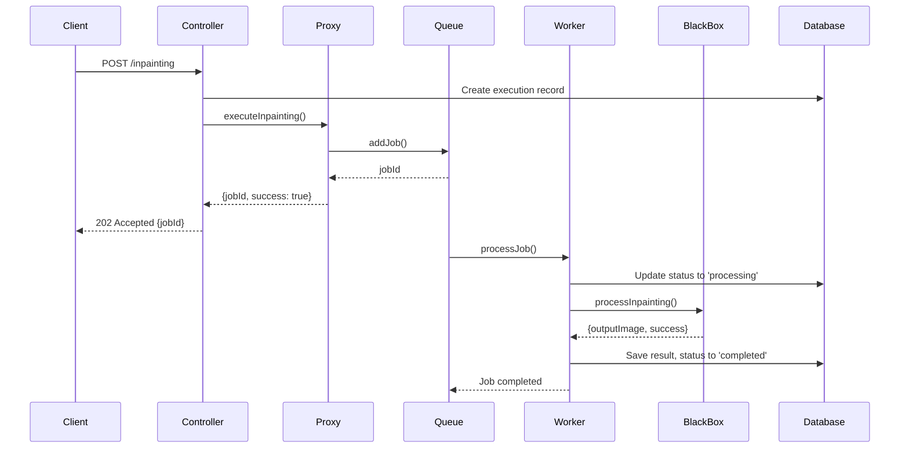

# Advanced Programming Project - Inpainting API

## Overview
This is an advanced Node.js/TypeScript application that provides an **Image Inpainting API** using a **queue-based architecture** with **BullMQ**. The application implements several design patterns including **Proxy**, **Singleton**, **Factory**, and **Repository** patterns to create a scalable and maintainable image processing service.

## Architecture Overview

The project follows a **layered architecture** with clear separation of concerns:

```
┌─────────────────┐    ┌──────────────────┐    ┌─────────────────┐
│   Controllers   │───►│      Proxy       │───►│      Queue      │
└─────────────────┘    └──────────────────┘    └─────────────────┘
                                                         │
┌─────────────────┐    ┌──────────────────┐    ┌─────────────────┐
│   Repository    │    │     Logger       │    │     Worker      │
└─────────────────┘    └──────────────────┘    └─────────────────┘
                                                         │
┌─────────────────┐                              ┌─────────────────┐
│    Database     │                              │   BlackBox      │
└─────────────────┘                              └─────────────────┘
```

## Project Structure
```
src/
├── app.ts                          # Main application entry point
├── controllers/
│   ├── userController.ts           # User authentication & management
│   └── executionController.ts      # Inpainting execution management
├── services/
│   └── blackBox.ts                 # Core inpainting service (Sharp implementation)
├── proxy/
│   └── blackBoxProxy.ts           # Proxy pattern for queue management
├── queue/
│   └── inpaintingQueue.ts         # BullMQ queue configuration
├── workers/
│   └── inpaintingWorker.ts        # Background job processor
├── repository/
│   ├── userRepository.ts          # User data access layer
│   └── executionRepository.ts     # Execution data access layer
├── middleware/
│   ├── authMiddleware.ts          # JWT authentication
│   ├── rateLimitMiddleware.ts     # Rate limiting
│   └── uploadMiddleware.ts        # File upload handling
├── factory/
│   └── loggerFactory.ts           # Logger factory pattern
├── utils/
│   ├── loggerDecorator.ts         # Decorator pattern for logging
│   ├── jwtUtils.ts                # JWT utilities
│   └── validationUtils.ts         # Input validation
├── routes/
│   ├── userRoutes.ts              # User API routes
│   └── executionRoutes.ts         # Execution API routes
├── models/
│   ├── User.ts                    # User entity model
│   └── Execution.ts               # Execution entity model
└── database/
    └── connection.ts               # Database connection setup
```

## How It Works

### 1. Request Flow
```
Client Request → Controller → Proxy → Queue → Worker → BlackBox → Database
```

### 2. Core Components

#### **Controllers Layer**
- **ExecutionController**: Handles HTTP requests for inpainting operations
- **UserController**: Manages user authentication and registration
- Implements proper error handling and logging
- Returns appropriate HTTP status codes

#### **Proxy Pattern**
- **BlackBoxProxy**: Acts as an intermediary between controllers and the queue system
- Validates requests before queuing
- Provides unified interface for different request types (processing/preview)
- Handles error cases gracefully

#### **Queue System (BullMQ)**
- **InpaintingQueue**: Manages job queuing with Redis backend
- Supports job priorities (preview jobs have higher priority)
- Implements retry mechanisms with exponential backoff
- Provides job status tracking

#### **Worker Process**
- **InpaintingWorker**: Background processor that handles queued jobs
- Updates job progress in real-time
- Communicates with BlackBox service
- Updates database with results
- Handles failures and retries

#### **BlackBox Service**
- **BlackBoxService**: Core image processing using Sharp library
- Implements actual inpainting algorithms
- Handles image format conversions
- Provides both processing and preview modes

#### **Repository Pattern**
- **ExecutionRepository**: Data access layer for executions
- **UserRepository**: Data access layer for users
- Implements singleton pattern
- Provides clean database abstraction

#### **Factory Pattern**
- **LoggerFactory**: Creates different types of loggers
- **ApiLogger**: Logs API requests/responses
- **ExecutionLogger**: Logs execution-specific events
- **ErrorLogger**: Logs errors and exceptions

### 3. Design Patterns Used

#### **Singleton Pattern**
- All services, repositories, and proxy classes use singleton pattern
- Ensures single instance throughout application lifecycle
- Memory efficient and provides consistent state

#### **Proxy Pattern**
- BlackBoxProxy controls access to the BlackBox service
- Adds queuing layer without changing client code
- Provides additional validation and error handling

#### **Factory Pattern**
- LoggerFactory creates appropriate logger instances
- Centralizes logger creation logic
- Easy to extend with new logger types

#### **Repository Pattern**
- Abstracts database operations
- Provides clean separation between business logic and data access
- Easy to test and mock

#### **Decorator Pattern**
- Logger decorators add functionality to base loggers
- Route-specific logging without modifying core logic

### 4. API Endpoints

#### **User Management Endpoints**
- `POST /api/users/register` - User registration
- `POST /api/users/login` - User login
- `GET /api/users/profile` - Get current user profile (protected)
- `GET /api/users/:userId` - Get user by ID (protected, requires authorization)
- `PUT /api/users/:userId` - Update user data (protected, requires authorization)
- `DELETE /api/users/:userId` - Delete user (protected, requires authorization)

#### **Execution Management Endpoints**
- `POST /api/executions/` - Submit inpainting job (protected)
- `POST /api/executions/preview` - Generate preview (no auth required)
- `GET /api/executions/:id` - Get execution basic info with user details (protected)
- `GET /api/executions/user` - Get current user's executions (protected) 
- `PUT /api/executions/:id` - Update execution (protected)
- `DELETE /api/executions/:id` - Delete execution (protected)
- `GET /api/executions/:id/download` - Get download URL for result image (protected)
- `GET /api/executions/:id/status` - Get execution status (protected)
- `GET /api/executions/job/:jobId/status` - Get job status by jobId (protected)

### 5. Queue Processing Flow



### 6. Technology Stack

#### **Backend**
- **Node.js** with **TypeScript** for type safety
- **Express.js** for REST API
- **BullMQ** for queue management
- **Redis** for queue storage and caching
- **Sharp** for image processing
- **SQLite/PostgreSQL** for data persistence

#### **Security & Middleware**
- **JWT** for authentication
- **bcrypt** for password hashing
- **express-rate-limit** for rate limiting
- **multer** for file uploads
- **helmet** for security headers

#### **Development Tools**
- **nodemon** for development
- **ESLint** for code linting
- **Prettier** for code formatting
- **Docker** for containerization

### 7. Environment Variables
```env
# Server Configuration
PORT=3000
NODE_ENV=development

# Database Configuration
DB_HOST=localhost
DB_PORT=5432
DB_NAME=inpainting_db
DB_USER=username
DB_PASS=password

# Redis Configuration
REDIS_HOST=localhost
REDIS_PORT=6379

# JWT Configuration
JWT_SECRET=your_secret_key
JWT_EXPIRES_IN=24h

# Worker Configuration
WORKER_CONCURRENCY=5

# File Upload
MAX_FILE_SIZE=10485760
UPLOAD_DIR=./uploads
```

### 8. Getting Started

#### **Prerequisites**
- Node.js (v18+ recommended)
- Redis server
- Database (SQLite/PostgreSQL)
- npm or yarn

#### **Installation**
```bash
# Clone repository
git clone <repository-url>
cd progetto-programmazione-avanzata

# Install dependencies
npm install

# Setup environment
cp .env.example .env
# Edit .env with your configuration

# Build TypeScript
npm run build

# Run database migrations (if applicable)
npm run migrate

# Start Redis server
redis-server

# Start the application
npm run dev

# Start worker process (in separate terminal)
npm run worker
```

#### **Docker Setup**
```bash
# Build and start all services
docker-compose up --build

# Start in detached mode
docker-compose up -d

# View logs
docker-compose logs -f

# Stop services
docker-compose down
```

### 9. Come Usare l'API con Postman - Guida Dettagliata

#### **Setup Iniziale Postman**
1. Crea una nuova Collection chiamata "Inpainting API"
2. Aggiungi una variabile d'ambiente `{{baseUrl}}` con valore `http://localhost:3000`
3. Aggiungi una variabile `{{authToken}}` che verrà popolata automaticamente

#### **Passo 1: Registrazione Utente**
```http
POST {{baseUrl}}/api/users/register
Content-Type: application/json

{
    "email": "test@example.com",
    "password": "password123",
    "name": "Test User"
}
```
{
    "name": "gir",
    "surname": "Test User",
    "email": "1test@example.com",
    "password": "password123"
    
}

**Risposta Attesa:**
```json
{
    "success": true,
    "message": "User registered successfully",
    "data": {
        "id": 1,
        "email": "test@example.com",
        "name": "Test User"
    }
}
```

#### **Passo 2: Login e Ottenimento Token**
```http
POST {{baseUrl}}/api/users/login
Content-Type: application/json

{
    "email": "test@example.com",
    "password": "password123"
}
```

**Risposta Attesa:**
```json
{
    "success": true,
    "message": "Login successful",
    "data": {
        "token": "eyJhbGciOiJIUzI1NiIsInR5cCI6IkpXVCJ9...",
        "user": {
            "id": 1,
            "email": "test@example.com",
            "name": "Test User"
        }
    }
}
```

**Script Post-Response in Postman:**
```javascript
if (pm.response.code === 200) {
    const response = pm.response.json();
    pm.environment.set("authToken", response.data.token);
    pm.environment.set("userId", response.data.user.id);
}
```

#### **Passo 3: Verificare Autenticazione**
```http
GET {{baseUrl}}/api/users/profile
Authorization: Bearer {{authToken}}
```

**Risposta Attesa:**
```json
{
    "success": true,
    "data": {
        "id": 1,
        "name": "Test User",
        "surname": "Test User",
        "email": "test@example.com",
        "createdAt": "2024-01-15T10:30:00Z"
    }
}
```

**Note Importanti:**
- L'endpoint `/api/users/profile` restituisce il profilo dell'utente autenticato (dal token JWT)
- L'endpoint `/api/users/:userId` richiede un ID specifico nei parametri URL
- Entrambi richiedono autenticazione Bearer token

#### **Passo 4: Creare un Job di Inpainting**
```http
POST {{baseUrl}}/api/executions/
Authorization: Bearer {{authToken}}
Content-Type: multipart/form-data

Key: originalImage | Type: File | Value: [Seleziona immagine JPG/PNG]
Key: maskImage     | Type: File | Value: [Seleziona immagine mask]
Key: userId        | Type: Text | Value: {{userId}}
Key: description   | Type: Text | Value: "Test inpainting"
```

**Risposta Attesa:**
```json
{
    "success": true,
    "message": "Inpainting job queued successfully",
    "data": {
        "jobId": "job_12345",
        "executionId": 1,
        "status": "queued",
        "queuePosition": 1
    }
}
```

**Script Post-Response:**
```javascript
if (pm.response.code === 202) {
    const response = pm.response.json();
    pm.environment.set("jobId", response.data.jobId);
    pm.environment.set("executionId", response.data.executionId);
}
```

#### **Passo 5: Monitorare lo Stato del Job**
```http
GET {{baseUrl}}/api/executions/job/{{jobId}}/status
Authorization: Bearer {{authToken}}
```

**Log Output Atteso:**
Quando esegui questa richiesta, dovresti vedere nei log dell'applicazione:

```
[2024-01-15T10:35:00.123Z] [INFO]: API_REQUEST: GET /api/executions/job/12345/status | Data: {"userId":1,"ip":"127.0.0.1","userAgent":"PostmanRuntime/7.32.3"}
[2024-01-15T10:35:00.125Z] [INFO]: EXECUTION_ACTION: JOB_STATUS_CHECK_REQUESTED | Data: {"jobId":"12345","userId":1,"timestamp":"2024-01-15T10:35:00.125Z"}
🔍 Checking status for job: 12345 by user: 1
[2024-01-15T10:35:00.128Z] [INFO]: EXECUTION_ACTION: JOB_STATUS_RETRIEVED | Data: {"jobId":"12345","userId":1,"status":"completed","progress":100,"timestamp":"2024-01-15T10:35:00.128Z"}
✅ Job status retrieved for 12345: completed (100%)
[2024-01-15T10:35:00.130Z] [INFO]: API_RESPONSE: GET /api/executions/job/12345/status - 200 | Data: {"userId":1,"statusCode":200,"executionTime":7}
```

**In caso di Job Non Trovato:**
```
[2024-01-15T10:35:00.123Z] [INFO]: API_REQUEST: GET /api/executions/job/invalid123/status
[2024-01-15T10:35:00.125Z] [INFO]: EXECUTION_ACTION: JOB_STATUS_CHECK_REQUESTED | Data: {"jobId":"invalid123","userId":1,"timestamp":"2024-01-15T10:35:00.125Z"}
🔍 Checking status for job: invalid123 by user: 1
[2024-01-15T10:35:00.127Z] [ERROR]: JOB_NOT_FOUND | Data: {"jobId":"invalid123","userId":1,"timestamp":"2024-01-15T10:35:00.127Z"}
❌ Job not found: invalid123
```

**In caso di Errore del Sistema:**
```
[2024-01-15T10:35:00.123Z] [INFO]: API_REQUEST: GET /api/executions/job/12345/status
[2024-01-15T10:35:00.125Z] [ERROR]: DATABASE_ERROR | Data: {"operation":"GET_JOB_STATUS","table":"queue","error":"Redis connection failed"}
[2024-01-15T10:35:00.126Z] [ERROR]: JOB_STATUS_ERROR | Data: {"jobId":"12345","userId":1,"error":"Redis connection failed","timestamp":"2024-01-15T10:35:00.126Z"}
❌ Error checking job status for 12345: Redis connection failed
```

#### **Passo 6: Scaricare il Risultato**
```http
GET {{baseUrl}}/api/executions/{{executionId}}/download
Authorization: Bearer {{authToken}}
```

**Possibili Risposte:**

**✅ Successo (Execution Completata e Autorizzata):**
- Status: `200 OK`
- Content-Type: `application/json`
- Body: JSON con URL di download
```json
{
    "success": true,
    "message": "Download URL generated successfully",
    "data": {
        "executionId": 1,
        "imageUrl": "/static/images/execution_1_user_1_1642251600000.png",
        "imageSize": 245680,
        "status": "completed"
    }
}
```

**⏳ Execution in Pending:**
- Status: `202 Accepted`
```json
{
    "success": false,
    "message": "Execution is still pending. Please wait for processing to complete.",
    "data": {
        "executionId": 1,
        "status": "pending",
        "createdAt": "2024-01-15T10:30:00Z",
        "updatedAt": "2024-01-15T10:30:00Z"
    }
}
```

**⚙️ Execution in Processing:**
- Status: `202 Accepted`
```json
{
    "success": false,
    "message": "Execution is currently being processed. Please try again in a few moments.",
    "data": {
        "executionId": 1,
        "status": "processing",
        "createdAt": "2024-01-15T10:30:00Z",
        "updatedAt": "2024-01-15T10:32:00Z"
    }
}
```

**❌ Execution Fallita:**
- Status: `422 Unprocessable Entity`
```json
{
    "success": false,
    "message": "Execution has failed. No result image is available.",
    "data": {
        "executionId": 1,
        "status": "failed",
        "createdAt": "2024-01-15T10:30:00Z",
        "updatedAt": "2024-01-15T10:35:00Z",
        "error": "Processing failed"
    }
}
```

**🚫 Execution Non Trovata:**
- Status: `404 Not Found`
```json
{
    "success": false,
    "message": "Execution not found",
    "data": {
        "executionId": 999,
        "status": "not_found"
    }
}
```

**🔒 Accesso Negato (Non Proprietario):**
- Status: `403 Forbidden`
```json
{
    "success": false,
    "message": "Access denied: You can only download your own executions",
    "data": {
        "executionId": 1,
        "status": "access_denied"
    }
}
```

**📸 Immagine Risultato Mancante:**
- Status: `404 Not Found`
```json
{
    "success": false,
    "message": "Result image not found or corrupted. Please try regenerating the execution.",
    "data": {
        "executionId": 1,
        "status": "completed",
        "error": "Output image missing"
    }
}
```

**Log Output per Download Autorizzato:**
```
[2024-01-15T10:40:00.123Z] [INFO]: API_REQUEST: GET /api/executions/1/download | Data: {"userId":1,"ip":"127.0.0.1"}
[2024-01-15T10:40:00.125Z] [INFO]: EXECUTION_ACTION: EXECUTION_DOWNLOADED | Data: {"executionId":1,"userId":1}
[2024-01-15T10:40:00.127Z] [INFO]: EXECUTION_ACTION: DOWNLOAD_ATTEMPT | Data: {"executionId":1,"userId":1,"timestamp":"2024-01-15T10:40:00.127Z"}
🔍 Download attempt for execution 1 by user 1
📊 Execution 1 status: completed
[2024-01-15T10:40:00.130Z] [INFO]: EXECUTION_ACTION: DOWNLOAD_SUCCESS | Data: {"executionId":1,"userId":1,"status":"completed","imageSize":245680,"timestamp":"2024-01-15T10:40:00.130Z"}
✅ Successfully serving download for execution 1 (245680 bytes)
```

**Log Output per Accesso Negato:**
```
[2024-01-15T10:40:00.123Z] [INFO]: API_REQUEST: GET /api/executions/5/download
🔍 Download attempt for execution 5 by user 1
[2024-01-15T10:40:00.127Z] [ERROR]: AUTHORIZATION_ERROR | Data: {"userId":1,"resource":"execution_5"}
[2024-01-15T10:40:00.128Z] [ERROR]: DOWNLOAD_ACCESS_DENIED | Data: {"executionId":5,"userId":1,"ownerId":2,"timestamp":"2024-01-15T10:40:00.128Z"}
❌ User 1 not authorized to download execution 5 (owned by 2)
```

**Sicurezza e Autorizzazione:**

1. **Token JWT Obbligatorio**: Tutti i download richiedono autenticazione
2. **Controllo Proprietà**: L'utente può scaricare solo le proprie executions
3. **Logging Completo**: Tutti i tentativi di accesso vengono registrati
4. **Validation del Status**: Controllo dello stato prima del download
5. **Error Handling Dettagliato**: Messaggi specifici per ogni scenario

**Come Testare l'Autorizzazione in Postman:**

1. **Test Download Autorizzato:**
   - Usa il token dell'utente proprietario
   - Usa `{{executionId}}` di una tua execution
   - Aspettati download dell'immagine o messaggio di stato

2. **Test Accesso Negato:**
   - Crea due utenti diversi
   - Con il primo utente crea un'execution (nota l'ID)
   - Fai login con il secondo utente
   - Prova a scaricare l'execution del primo utente
   - Aspettati `403 Forbidden`

3. **Test Senza Token:**
   - Rimuovi l'header `Authorization`
   - Aspettati `401 Unauthorized`

### 10. Come Verificare che i Design Patterns Funzionano

#### **A. Verificare il Pattern Singleton**

**Test 1: Singleton dei Repository**
```http
GET {{baseUrl}}/api/debug/singleton-test
Authorization: Bearer {{authToken}}
```

Questo endpoint (da implementare per il debug) dovrebbe mostrare:
```json
{
    "userRepositoryInstances": 1,
    "executionRepositoryInstances": 1,
    "message": "Singleton pattern working correctly"
}
```

**Test nei Log:**
Cerca nei log dell'applicazione:
```
[DEBUG] UserRepository instance created: <memory_address>
[DEBUG] UserRepository instance retrieved: <same_memory_address>
```

#### **B. Verificare il Pattern Proxy**

**Test 2: Proxy Intercepting Requests**
```http
POST {{baseUrl}}/api/executions/inpainting
Authorization: Bearer {{authToken}}
Content-Type: multipart/form-data

Key: originalImage | Type: File | Value: [File corrotto]
Key: maskImage     | Type: File | Value: [File valido]
Key: userId        | Type: Text | Value: {{userId}}
```

**Comportamento Atteso:**
Il Proxy dovrebbe intercettare e validare prima di passare alla coda:
```json
{
    "success": false,
    "message": "Invalid image format detected by proxy",
    "error": "Proxy validation failed"
}
```

**Test nei Log:**
```
[INFO] BlackBoxProxy: Validating request before queuing
[WARN] BlackBoxProxy: Invalid image detected, request blocked
```

#### **C. Verificare il Pattern Factory**

**Test 3: Factory Creating Different Loggers**
Controlla i log dell'applicazione durante le varie operazioni:

```
[API-LOG] 2024-01-15T10:30:00Z POST /api/executions/inpainting
[EXECUTION-LOG] 2024-01-15T10:30:05Z Execution 1 started processing
[ERROR-LOG] 2024-01-15T10:30:10Z Queue connection failed
```

Ogni tipo di log dovrebbe avere un formato diverso, indicando che il Factory sta creando logger specifici.

#### **D. Verificare il Pattern Repository**

**Test 4: Repository Abstraction**
```http
GET {{baseUrl}}/api/executions/user/{{userId}}
Authorization: Bearer {{authToken}}
```

**Verifica nei Log:**
```
[DEBUG] ExecutionRepository: findByUserId called
[DEBUG] Database query executed: SELECT * FROM executions WHERE user_id = ?
[DEBUG] Repository returned 3 executions
```

### 11. Test di Carico e Performance con Postman

#### **Test di Carico Semplice**
1. Crea una Collection con multiple richieste di inpainting
2. Usa il Collection Runner di Postman
3. Imposta 10 iterazioni con delay di 1 secondo
4. Monitora come la coda gestisce i job multipli

#### **Test del Rate Limiting**
```http
POST {{baseUrl}}/api/executions/inpainting
Authorization: Bearer {{authToken}}
```
Esegui rapidamente 20 volte. Dopo il limite (es. 10 richieste/minuto) dovresti ricevere:
```json
{
    "success": false,
    "message": "Too many requests",
    "retryAfter": 60
}
```

### 12. Debugging e Monitoraggio in Tempo Reale

#### **Endpoint di Debug (Solo per Development)**
```http
GET {{baseUrl}}/api/debug/queue-status
Authorization: Bearer {{authToken}}
```

**Risposta:**
```json
{
    "waiting": 3,
    "active": 2,
    "completed": 15,
    "failed": 1,
    "workers": {
        "active": 2,
        "total": 5
    }
}
```

#### **Monitoring dei Pattern**
```http
GET {{baseUrl}}/api/debug/patterns-status
Authorization: Bearer {{authToken}}
```

**Risposta:**
```json
{
    "patterns": {
        "singleton": {
            "userRepository": "active",
            "executionRepository": "active",
            "instances": 1
        },
        "proxy": {
            "requestsIntercepted": 45,
            "validationsPassed": 42,
            "validationsFailed": 3
        },
        "factory": {
            "apiLoggers": 1,
            "executionLoggers": 1,
            "errorLoggers": 1
        },
        "repository": {
            "queries": 128,
            "cacheHits": 45,
            "cacheMisses": 83
        }
    }
}
```

### 13. Workflow Completo di Test

#### **Scenario 1: Utente Nuovo**
1. **Registrazione** → Verifica risposta 201
2. **Login** → Salva token
3. **Profile** → Verifica autenticazione
4. **Inpainting** → Invia job
5. **Monitor** → Controlla stato ogni 5 secondi
6. **Download** → Scarica risultato

#### **Scenario 2: Test dei Pattern**
1. **Multiple Login** → Verifica Singleton
2. **Invalid Image** → Verifica Proxy
3. **Check Logs** → Verifica Factory
4. **Database Queries** → Verifica Repository

#### **Scenario 3: Test di Stress**
1. **Burst Requests** → Test rate limiting
2. **Large Files** → Test upload limits
3. **Queue Overflow** → Test queue management

### 14. License
This project is licensed under the MIT License - see the LICENSE file for details.

### 15. Troubleshooting Comune

#### **Errore: "Queue connection failed"**
- Verifica che Redis sia in esecuzione
- Controlla le variabili d'ambiente REDIS_HOST e REDIS_PORT

#### **Errore: "Token expired"**
- Rifare il login per ottenere un nuovo token
- Controlla JWT_EXPIRES_IN nelle variabili d'ambiente

#### **Errore: "File too large"**
- Controlla MAX_FILE_SIZE nelle variabili d'ambiente
- Riduci la dimensione dell'immagine

#### **Job rimane in "waiting"**
- Verifica che il worker sia in esecuzione (`npm run worker`)
- Controlla i log del worker per errori

#### **Pattern non funzionano**
- Controlla che l'applicazione sia compilata (`npm run build`)
- Verifica i log per errori di inizializzazione
- Riavvia l'applicazione per ripristinare i Singleton