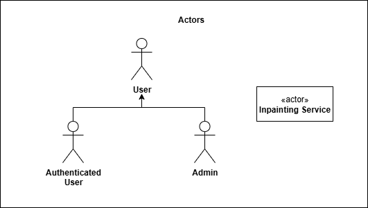
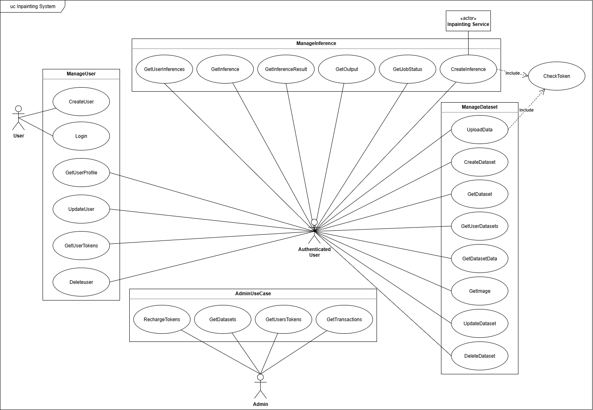
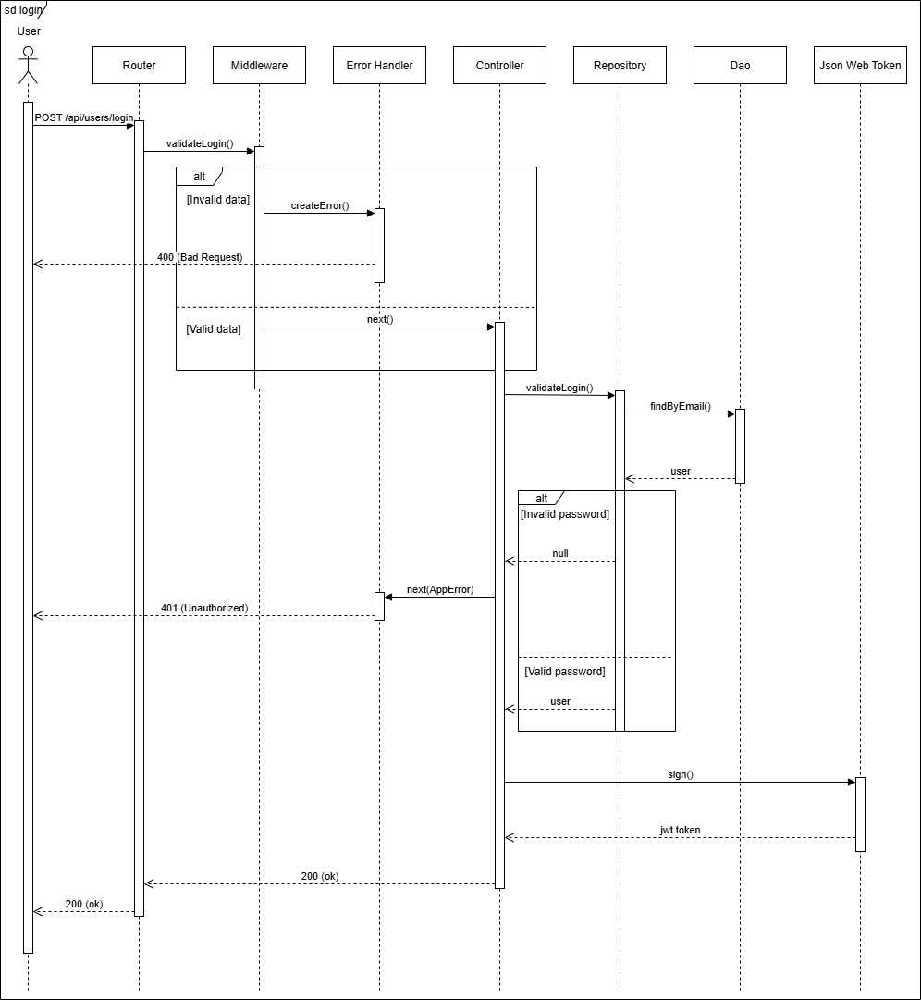
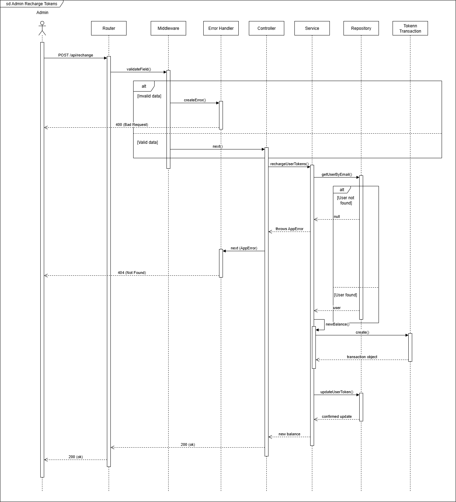
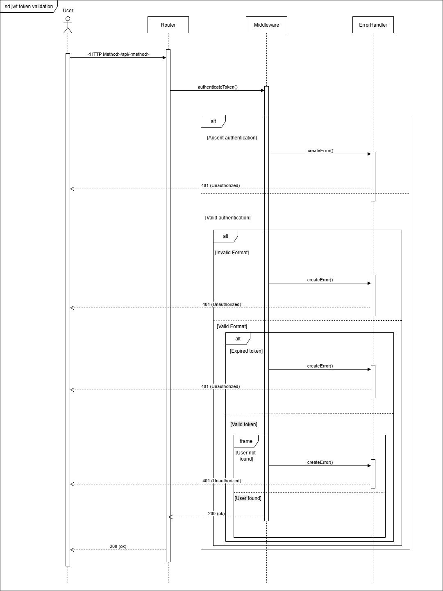
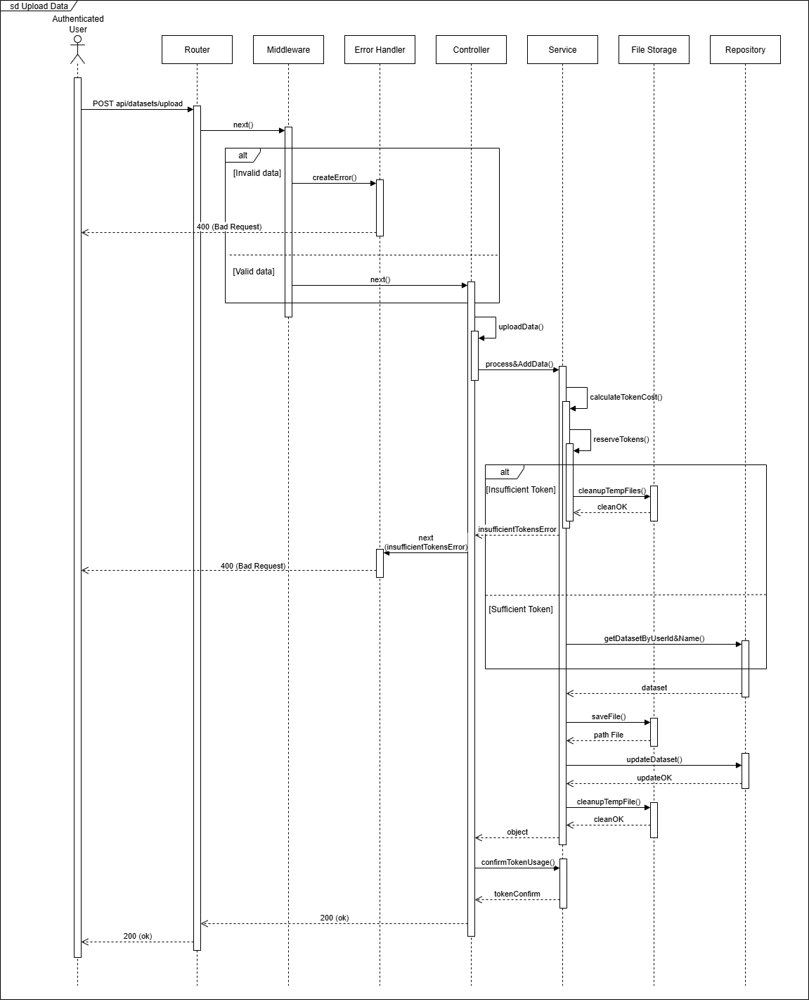
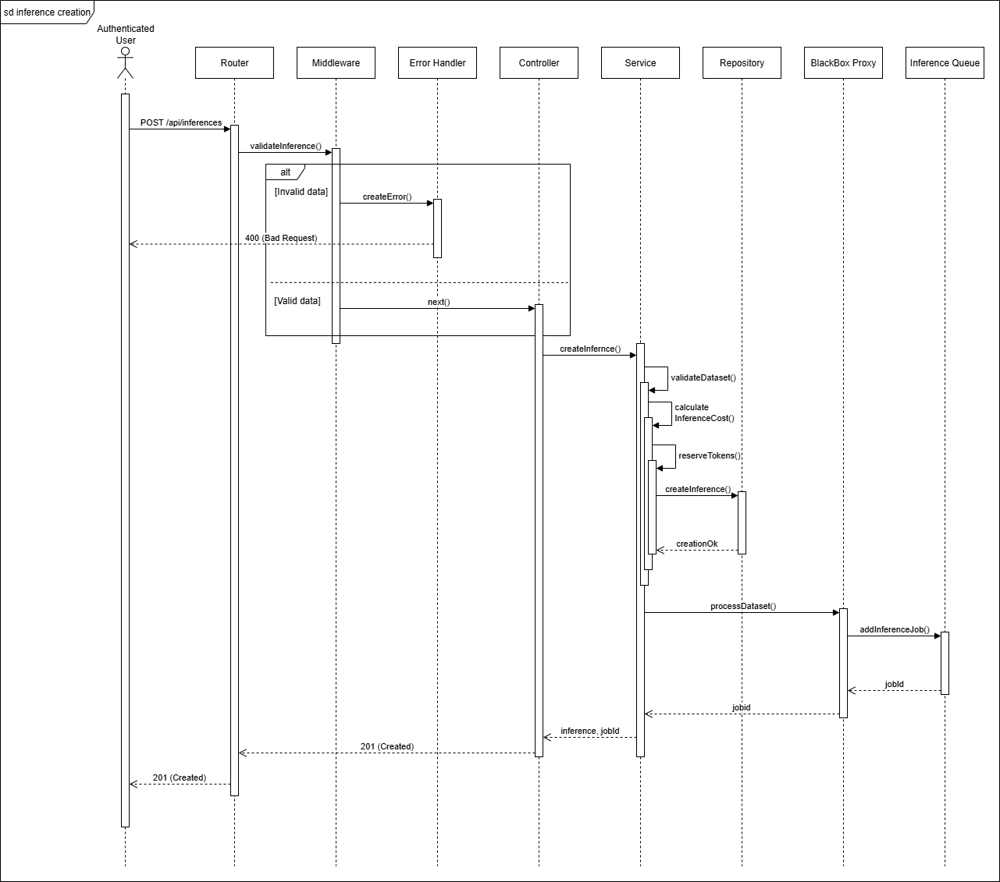
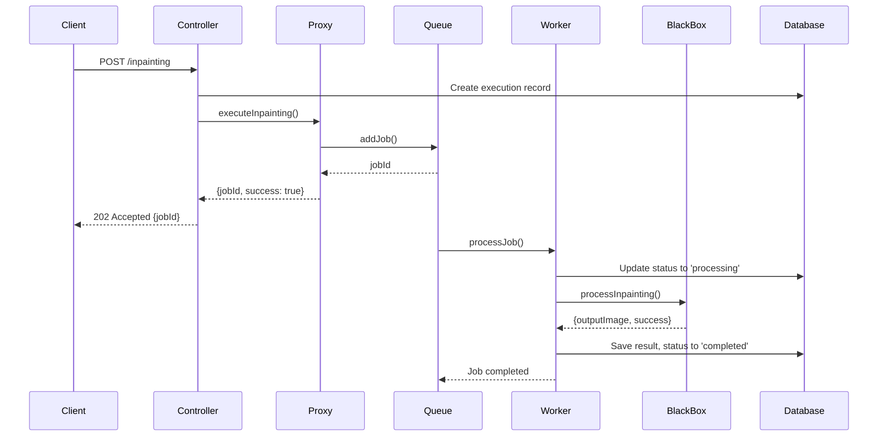

# P.A. Inpainting

<div align="center">
  <!-- Technology badges with logos and links -->
  <a href="https://www.postman.com/" target="_blank">
    
  </a>
  <a href="https://github.com/" target="_blank">
    
  </a>
  <a href="https://jestjs.io/" target="_blank">
    
  </a>
  <a href="https://jwt.io/" target="_blank">
    
  </a>
  <a href="https://sequelize.org/" target="_blank">
    
  </a>
  <a href="https://www.python.org/" target="_blank">
    
  </a>
  <a href="https://www.javascript.com/" target="_blank">
    
  </a>
  <a href="https://www.typescriptlang.org/" target="_blank">
    
  </a>
  <a href="https://nodejs.org/" target="_blank">
    
  </a>
  <a href="https://expressjs.com/" target="_blank">
    
  </a>
  <a href="https://www.docker.com/" target="_blank">
    
  </a>
  <a href="https://docs.docker.com/compose/" target="_blank">
    
  </a>
  <a href="https://eslint.org/" target="_blank">
    
  </a>
  <a href="https://redis.io/" target="_blank">
    
  </a>
  <a href="https://www.postgresql.org/" target="_blank">
    
  </a>
  <a href="https://bull.io/" target="_blank">
    
  </a>
  <a href="https://www.npmjs.com/" target="_blank">
    
  </a>
  <a href="https://axios-http.com/" target="_blank">
    
  </a>
  <a href="https://www.npmjs.com/package/bcrypt" target="_blank">
    
  </a>
  <a href="https://github.com/expressjs/multer" target="_blank">
    
  </a>
  <a href="https://helmetjs.github.io/" target="_blank">
    
  </a>
  <a href="https://github.com/winstonjs/winston" target="_blank">
    
  </a>
</div>

---

## Introduction

**P.A. Inpainting** is a Node.js backend service. It supports dataset and inference management for images, masks, and videos, using a queue-based architecture for scalable processing. The system enforces a token-based credit model for users, with costs per operation and admin recharge capabilities.

---

## 📑 Index

- [Features](#features)
- [Token & Credit System](#token--credit-system)
- [Installation](#installation)
- [Environment Setup](#environment-setup)
- [API Documentation](#api-documentation)
- [API Routes & Responses](#api-routes--responses)
- [Database Structure](#database-structure)
- [Architecture](#architecture)
- [Design Patterns](#design-patterns)
- [Sequence Diagrams](#sequence-diagrams)
- [Testing](#testing)

---
## Main Features 

- **User Management & Authentication**
  - Secure JWT-based authentication
  - User registration with bcrypt password hashing
  - Role-based access (User, Admin)
  - Protected API endpoints (JWT required, except register and login)

- **Token & Credit System**
  - Each authenticated user has a token balance .
  - User token balance for operations
  - Operation costs vary by type (image/video/zip upload, inference):
      - Image upload: `0.65 token/image`
      - ZIP upload: `0.7 token/valid file`
      - Video upload: `0.4 token/frame`
      - Inference: `2.75 token/image`, `1.5 token/frame`
  - Operations are denied if credits are insufficient (`401 Unauthorized`).
  - Credit balance is stored in the DB and can be checked via a protected route.

- **Dataset Management**
  - CRUD operations on datasets (logical delete supported)
  - Multi-format upload:
    - Image + mask pairs
    - Videos (with mask or mask video)
    - ZIP archives (structured dataset folders)
  - Media processing:
    - Frame extraction from videos (1 FPS with FFmpeg)
    - Mask validation (binary check with Sharp)
  - Secure data access via temporary signed URLs (JWT-based)

- **Asynchronous Inference System**
  - Job queueing with Redis + Bull 
  - Background processing by separate worker
  - Worker → Python microservice (Flask + OpenCV) for inference
  - Job status tracking: PENDING, RUNNING, COMPLETED, FAILED, ABORTED
  - Result retrieval via API + secure download links

- **Administration Features**
  - Admin token recharge for users
  - Monitoring dashboard APIs:
    - Full list of datasets (including orphaned ones)
    - Full list of token transactions with aggregation


---

## ZIP Format


- The ZIP archive must contain **subfolders**, each representing a dataset group.
- Inside each subfolder, files must be organized as **image/video + mask pairs**:
  - The **mask file** must contain the word `mask` in its filename.
  - If multiple pairs exist, they must be indexed numerically (`image_1.png` + `mask_1.png`, `video_2.mp4` + `mask_2.png`, etc.).
- **Supported file formats**:  
  - Images: `.png`, `.jpg`, `.jpeg`  
  - Videos: `.mp4`, `.avi`  
  - All other formats are ignored.
- On upload, files from the ZIP are stored under the `image` field.  
  Since the upload method also expects a `mask` field, this will be populated with a placeholder file (ignored by the system).

### Example Structure

```plaintext
dataset.zip
│
├── group1/
│   ├── image_1.png
│   ├── mask_1.png
│   ├── video_2.mp4
│   ├── mask_2.png
│   └── notes.txt   (ignored)
│
├── group2/
│   ├── sample_1.jpg
│   ├── mask_1.jpg
│   ├── sample_2.jpeg
│   └── mask_2.jpeg
│
└── group3/
    ├── clip_1.avi
    └── mask_1.png
```
---

## Installation

### Requirements

- [Node.js](https://nodejs.org/) (v18+)
- [Docker](https://www.docker.com/) & [Docker Compose](https://docs.docker.com/compose/)
- [Redis](https://redis.io/) (via Docker)
- [PostgreSQL](https://www.postgresql.org/) (via Docker)
- [Python 3.9+](https://www.python.org/) (for inference service, handled by Docker)

### Quick Start (Docker Compose)

```bash
# Clone the repository
git clone <repository-url>
cd Progetto Programmazione Avanzata

# Copy and edit environment variables
cp .env
# Edit .env as needed

# Build and start all services
docker-compose up --build

# (Optional) Run in detached mode
docker-compose up -d

# Stop services
docker-compose down
```

---

## Environment Setup

Example `.env` configuration:

```env
NODE_ENV=development
PORT=3000
HOST=0.0.0.0

DB_HOST=postgres
DB_PORT=5432
POSTGRES_DB=pa_db
POSTGRES_USER=postgres
POSTGRES_PASSWORD=1234

REDIS_HOST=redis
REDIS_PORT=6379

JWT_SECRET=your_secret_key
JWT_EXPIRES_IN=24h

BCRYPT_SALT_ROUNDS=12
WORKER_CONCURRENCY=3
LOG_LEVEL=debug

ADMIN_NAME=Administrator
ADMIN_SURNAME=System
ADMIN_EMAIL=admin@system.com
ADMIN_PASSWORD=AdminPassword123!

UPLOAD_DIRECTORY=./uploads

INFERENCE_BLACKBOX_HOST=0.0.0.0
INFERENCE_BLACKBOX_PORT=5000
INFERENCE_BLACKBOX_DEBUG=false
INFERENCE_BLACKBOX_UPLOAD_DIR=/usr/src/app/uploads
INFERENCE_BLACKBOX_LOG_LEVEL=INFO
```

---

## API Documentation

All endpoints are JWT-protected unless register and login for user.

### User
- `POST /api/users/user` - Register user
- `POST /api/users/session` - Login and get JWT
- `GET /api/users/profile` - Get current user profile
- `GET /api/users/tokens` - Get user's remaining tokens
- `PUT /api/users/:userId` - Update user data
- `DELETE /api/users/:userId` - Delete user

### Dataset
- `POST /api/datasets/` - Create dataset (name, tags)
- `POST /api/datasets/data` - Upload image/mask or video/mask to dataset
- `GET /api/datasets/` - List datasets
- `GET /api/datasets/:name` - Get dataset info
- `GET /api/datasets/:name/data` - Get dataset items
- `GET /api/datasets/image/:imagePath` - Get image from dataset
- `PUT /api/datasets/:name` - Update dataset
- `DELETE /api/datasets/:name` - Logical deletion of dataset

### Inference
- `POST /api/inferences/` - Start inference on dataset
- `GET /api/inferences/job/:jobId/status` - Get job status
- `GET /api/inferences/` - Get all inferences 
- `GET /api/inferences/:id` - Get specific inference
- `GET /api/inferences/:id/results` - Get inference result
- `GET /api/inferences/download/:token` - Download specific result

### Admin
- `GET /api/admin/users/:email/tokens` - Get token balance for user
- `POST /api/admin/user-tokens` - Recharge user tokens
- `GET /api/admin/transactions` - List transactions
- `GET /api/admin/datasets` - List all datasets (optionally include deleted)

---

## API Routes & Responses

Below are all main API routes, grouped by feature, with example JSON outputs.
All API routes are in the file ["PA.postman_collection"](PA.postman_collection).

### User

#### Register
`POST /api/users/user`
```json
// Success
{
  "success": true,
  "message": "User registered successfully",
  "data": {
    "id": "uuid",
    "name": "Mario",
    "surname": "Rossi",
    "email": "mariorossi@gmail.com",
    "tokens": 100
  }
}

```

#### Login
`POST /api/users/session`
```json
// Success
{
  "success": true,
  "message": "Login successful",
  "data": {
    "token": "jwt-token",
    "user": {
      "id": "uuid",
      "name": "Mario",
      "surname": "Rossi",
      "email": "mariorossi@gmail.com",
      "tokens": 100
    }
  }
}

```

#### Profile
`GET /api/users/profile`
```json
{
  "success": true,
  "data": {
    "id": "uuid",
    "name": "Mario",
    "surname": "Rossi",
    "email": "mariorossi@gmail.com",
    "tokens": 100,
    "createdAt": "2024-01-01T10:00:00Z"
  }
}
```

#### Update User
`PUT /api/users/:userId`
```json
{
  "success": true,
  "message": "User updated successfully",
  "data": { /* updated user fields */ }
}
```

#### Delete User
`DELETE /api/users/:userId`
```json
{
  "success": true,
  "message": "User deleted successfully"
}
```

#### Get Token Balance
`GET /api/users/tokens`
```json
{
  "success": true,
  "tokens": 100
}
```

---

### Dataset

#### Create Dataset
`POST /api/datasets/`
```json
// Success
{
  "success": true,
  "message": "Dataset created",
  "data": {
    "id": "uuid",
    "name": "Inpainting dataset",
    "tags": ["Inpainting", "Damage", "Mask"],
    "isDeleted": false,
    "createdAt": "2024-01-01T10:00:00Z"
  }
}
```

#### Update Dataset
`PUT /api/datasets/:id`
```json
{
  "success": true,
  "message": "Dataset updated",
  "data": { /* updated dataset fields */ }
}
```

#### Delete Dataset (logical)
`DELETE /api/datasets/:id`
```json
{
  "success": true,
  "message": "Dataset deleted (logical)"
}
```

#### List Datasets
`GET /api/datasets/`
```json
{
  "success": true,
  "data": [
    {
      "id": "uuid",
      "name": "Inpainting dataset",
      "tags": ["Inpainting", "Damage", "Mask"],
      "isDeleted": false,
      "createdAt": "2024-01-01T10:00:00Z"
    }
    // ...other datasets
  ]
}
```

#### Get Dataset Items
`GET /api/datasets/:name/data`
```json
{
  "success": true,
  "data": {
    "items": [
      {
        "index": 0,
        "imagePath": "datasets/uuid/image1.jpg",
        "maskPath": "datasets/uuid/mask1.png",
        "type": "image"
      },
      {
        "index": 1,
        "imagePath": "datasets/uuid/video1.mp4",
        "maskPath": "datasets/uuid/video1_mask.mp4",
        "type": "video"
      }
      // ...
    ]
  }
}
```

#### Upload Data (image/video/zip)
`POST /api/datasets/upload-data`
```json
// Success
{
  "success": true,
  "message": "Data uploaded and processed",
  "processedItems": 5,
  "tokensUsed": 3.25,
  "tokensRemaining": 96.75
}
```

---

### Inference

#### Start Inference
`POST /api/inferences/`
```json
// Success
{
  "success": true,
  "message": "Inference started",
  "data": {
    "inferenceId": "uuid",
    "status": "PENDING",
    "modelId": "default_inpainting",
    "parameters": { /* ... */ }
  }
}
```

#### Get Inference Status
`GET /api/inferences/:id/status`
```json
{
  "success": true,
  "data": {
    "inferenceId": "uuid",
    "status": "RUNNING", // or PENDING, FAILED, ABORTED, COMPLETED
    "progress": 60,
    "error": null
  }
}
```

#### Get Inference Result
`GET /api/inferences/:id/results`
```json
// Success (COMPLETED)
{
  "success": true,
  "data": {
    "inferenceId": "uuid",
    "status": "COMPLETED",
    "result": {
      "images": [
        {
          "originalPath": "datasets/uuid/image1.jpg",
          "outputPath": "inferences/uuid/processed_image1.png"
        }
      ],
      "videos": [
        {
          "originalVideoId": "1",
          "outputPath": "inferences/uuid/video_1.mp4"
        }
      ]
    }
  }
}
```

---

### Admin

#### Recharge User Tokens
`POST /api/admin/user-tokens`
```json
{
  "success": true,
  "message": "User tokens updated",
  "data": {
    "email": "mariorossi@gmail.com",
    "tokens": 200
  }
}
```

#### Get User Token Balance
`GET /api/admin/users/:email/tokens`
```json
{
  "success": true,
  "email": "mariorossi@gmail.com",
  "tokens": 200
}
```

#### List Transactions
`GET /api/admin/transactions`
```json
{
  "success": true,
  "data": [
    {
      "id": "uuid",
      "userEmail": "mariorossi@gmail.com",
      "amount": 100,
      "type": "recharge",
      "createdAt": "2024-01-01T10:00:00Z"
    }
    // ...
  ]
}
```

#### List All Datasets (admin)
`GET /api/admin/datasets`
```json
{
  "success": true,
  "data": [
    {
      "id": "uuid",
      "name": "Inpainting dataset",
      "tags": ["Inpainting", "Damage", "Mask"],
      "isDeleted": false,
      "createdAt": "2024-01-01T10:00:00Z"
    }
    // ...other datasets
  ]
}
```

---

## Database Structure

The application uses PostgreSQL with the following tables:

- **Users**: Stores user account information, authentication credentials, token balance, and user roles.
- **Datasets**: Contains metadata and data references for uploaded datasets, including images, videos, tags, and logical deletion status.
- **Inferences**: Tracks inference jobs, their status, parameters, results, and associations to users and datasets.
- **Token_transactions**: Records all token-related operations for audit purposes, including recharges, deductions, and transaction details.


---

### Table Fields

#### **Users**
| Field         | Type                | Description                                      |
|---------------|---------------------|--------------------------------------------------|
| id            | UUID                | Unique user identifier                           |
| name          | VARCHAR(100)        | User's first name                                |
| surname       | VARCHAR(100)        | User's last name                                 |
| email         | VARCHAR(255)        | User's email address (unique)                    |
| password      | VARCHAR(255)        | Hashed password                                  |
| tokens        | DECIMAL(10,2)       | Current token/credit balance                     |
| role          | user_role (enum)    | User role: 'user' or 'admin'                     |
| created_at    | TIMESTAMP           | Account creation timestamp                       |
| updated_at    | TIMESTAMP           | Last update timestamp                            |

#### **Datasets**
| Field             | Type           | Description                                                    |
|-------------------|----------------|----------------------------------------------------------------|
| id                | UUID           | Unique dataset identifier                                      |
| user_id           | UUID           | Reference to owner user (nullable)                             |
| name              | VARCHAR(255)   | Dataset name                                                   |
| data              | JSONB          | JSON containing image-mask pairs or video frame-mask lists     |
| tags              | TEXT[]         | Array of tags for categorization                               |
| is_deleted        | BOOLEAN        | Logical deletion flag                                          |
| next_upload_index | INTEGER        | Tracks next upload index for incremental uploads               |
| created_at        | TIMESTAMP      | Dataset creation timestamp                                     |
| updated_at        | TIMESTAMP      | Last update timestamp                                          |

#### **Inferences**
| Field        | Type              | Description                                         |
|--------------|-------------------|-----------------------------------------------------|
| id           | UUID              | Unique inference identifier                         |
| status       | inference_status  | Job status: 'PENDING', 'RUNNING', etc.              |
| model_id     | VARCHAR(255)      | Model used for inference                            |
| parameters   | JSONB             | Inference parameters (e.g., Grad-Cam settings)      |
| result       | JSONB             | Output/result of the inference                      |
| dataset_id   | UUID              | Reference to the associated dataset                 |
| user_id      | UUID              | Reference to the user who started the inference     |
| created_at   | TIMESTAMP         | Inference creation timestamp                        |
| updated_at   | TIMESTAMP         | Last update timestamp                               |

#### **Token_transactions**
| Field           | Type            | Description                                         |
|-----------------|-----------------|-----------------------------------------------------|
| id              | UUID            | Unique transaction identifier                       |
| user_id         | UUID            | Reference to the user involved                      |
| operation_type  | VARCHAR(50)     | Type of operation (e.g., recharge, deduction)       |
| operation_id    | VARCHAR(255)    | Related operation/job identifier (optional)         |
| amount          | DECIMAL(10,2)   | Amount of tokens changed                            |
| balance_before  | DECIMAL(10,2)   | User's token balance before the transaction         |
| balance_after   | DECIMAL(10,2)   | User's token balance after the transaction          |
| status          | VARCHAR(20)     | Transaction status (e.g., completed)                |
| description     | TEXT            | Additional details or notes                         |
| created_at      | TIMESTAMP       | Transaction creation timestamp                      |

---


## System Architecture
The system architecture implements the following schema.

```plaintext
                   +---------------------------+
                   |      Client (User)        |
                   +-------------^-------------+
                                 | (HTTP/S Request)
                   +-------------v-------------+
                   |    Router (Express.js)    |
                   +-------------^-------------+
                                 | (next())
                   +-------------v-------------+
                   |     Middleware Layer      |
                   |---------------------------|
                   | 1. Security (Helmet)      |
                   | 2. CORS                   |
                   | 3. Auth (JWT Middleware)  |
                   | 4. Input Validation       |
                   | 5. File Upload (Multer)   |
                   +-------------^-------------+
                                 | (next())
                   +-------------v-------------+
                   |      Controller Layer     |
                   |---------------------------|
                   | - Handles HTTP requests   |
                   | - Formats response        |
                   +-------------^-------------+
                                 | (method call)
                   +-------------v-------------+
                   |       Service Layer       |
                   |---------------------------|
                   | - Business logic          |
                   | - Orchestrates Repo/Proxy |
                   | - Calls TokenService      |
                   +-------------^-------------+
                                 | (uses)
+--------------------------------+--------------------------------+
|          Proxy Layer           |        Repository Layer        |
|--------------------------------|--------------------------------|
| - Interface for Job Queue      | - Abstracts DB operations      |
+-----------------^--------------+----------------^---------------+
                  | (addJob)                       | (find, create)
+-----------------v--------------+----------------v---------------+
|         Queue System           |         DAO Layer              |
|--------------------------------|--------------------------------|
| - Adds jobs to Redis           | - Executes Sequelize queries   |
+-----------------^--------------+----------------v---------------+
                  | (Persist job)                | (Executes query)
+-----------------v--------------+----------------v---------------+
|        Infrastructure          |       Models (Sequelize)       |
|--------------------------------|--------------------------------|
|       (Redis)                  | - Map tables to objects        |
+--------------------------------+----------------^---------------+
                                                  | (uses connection)
                                  +---------------v----------------+
                                  |     Database (PostgreSQL)      |
                                  +--------------------------------+


- **Router**: Maps HTTP routes to controllers.
- **Controller**: Handles request logic, validation, error handling.
- **Middleware**: Auth, rate limiting, file upload, logging.
- **Proxy**: Intercepts requests, validates, queues jobs.
- **Queue**: BullMQ job management.
- **Worker**: Background job processor.
- **Service**: Core business logic (e.g., image processing).
- **Repository**: Data access abstraction.
- **DAO**: Direct database operations.
- **Model**: Entity definitions.
```


## Inference Workflow (Worker + External Service)
The Inference Workflow implements the following schema.

```plaintext
+--------------------------------+
|         Queue System           |
|--------------------------------|
|       (Redis / Bull)           |
+-----------------^--------------+
                  | (Fetch Job)
+-----------------v--------------+
|       Worker Process           |
|--------------------------------|
| - Executes job logic           |
+-----------------^--------------+
                  | (Calls)
+-----------------v--------------+
|        Adapter Layer           |
|--------------------------------|
| - Translates the request       |
| - Handles HTTP call            |
+-----------------^--------------+
                  | (HTTP Request)
+-----------------v--------------+
|   External Service (Python)    |
|--------------------------------|
| - Flask, OpenCV                |
| - Runs inference               |
+-----------------^--------------+
                  | (HTTP Response)
+-----------------v--------------+
|        Adapter Layer           |
|--------------------------------|
| - Receives & formats response  |
+-----------------^--------------+
                  | (Returns result)
+-----------------v--------------+
|       Worker Process           |
|--------------------------------|
| - Updates DB via Repository    |
| - Confirms/Refunds Tokens      |
+--------------------------------+

- **Queue**: Stores inference jobs asynchronously (Redis + Bull).  
- **Worker**: Processes jobs in the background.  
- **Adapter**: Translates requests and responses, handles HTTP calls to the external service.  
- **External Service**: Python microservice (Flask + OpenCV) that executes inference.  
- **Repository**: Persists job results and state updates to the database.  
- **Token Service**: Confirms or refunds tokens depending on job success.  
```

---
## Patterns

This project extensively uses classic patterns to ensure a **robust, maintainable, and scalable architecture**. Below are the main patterns used, with their purpose and rationale.

---

### 1. Singleton
**Purpose:** Ensures a class has only one instance and provides a global access point.  
**Why used:** Ideal for shared resources or services that maintain global state, avoiding multiple expensive instances.  
**Example usage:**  
- `DbConnection`: single database connection pool  
- `InferenceQueue`: single Redis connection  
- All DAOs, Repositories, Services, Proxies, and Adapters  

---

### 2. Factory Method
**Purpose:** Defines an interface for creating objects but lets subclasses decide which concrete class to instantiate.  
**Why used:** Centralizes creation of complex objects (e.g., error messages, loggers) and decouples client code from specific creation logic.  
**Example usage:**  
- `ErrorManager`: Creates standardized error objects  
- `LoggerFactory`: Creates specialized loggers for different domains  

---

### 3. DAO & Repository
**Purpose:** Separates database access logic into two layers:  
- DAO: Executes direct queries (technical layer)  
- Repository: Provides a clean, domain-oriented interface, orchestrates DAO calls  
**Why used:** Clear separation of business logic and persistence  
**Example usage:**  
- DAO: `UserDao`, `DatasetDao`, `InferenceDao`, `TransactionDao`  
- Repository: `UserRepository`, `DatasetRepository`, `InferenceRepository`, `TransactionRepository`  

---

### 4. Chain of Responsibility
**Purpose:** Passes a request along a chain of handlers; each decides whether to process or forward it.  
**Why used:** Flexible and decoupled pipeline for request processing, validation, or error handling  
**Example usage:**  
- `errorHandler.ts`: logErrors → classifyError → formatErrorResponse → sendErrorResponse  
- `auth.middleware.ts`: authenticateToken chain  

---

### 5. Proxy
**Purpose:** Provides a surrogate to control access to another object.  
**Why used:** Intercepts calls to the real object, adding functionality before or after delegating  
**Example usage:**  
- `InferenceBlackBoxProxy`: intermediates between Controllers/Services and InferenceQueue  

---

### 6. Adapter
**Purpose:** Converts one interface into another expected by the client.  
**Why used:** Integrates external or legacy components without changing existing code  
**Example usage:**  
- `InferenceBlackBoxAdapter`: Bridges Node.js/TypeScript and Python/Flask inference service  

---

### 7. MVC (Model-View-Controller) for APIs
**Purpose:** Separates application logic into three components:  
- Model: Data and business logic  
- View: Representation of data (JSON in APIs)  
- Controller: Handles input, orchestrates Model & View  
**Why used:** Fundamental for organizing the backend and ensuring separation of concerns  
**Example usage:**  
- `UserController`, `DatasetController`, `InferenceController`  

---

### 8. Middleware
**Purpose:** Chain of reusable functions that handle HTTP requests.  
**Why used:** Decomposes request handling into isolated, reusable steps (authentication, validation, logging, etc.)  
**Example usage:**  
- `auth.middleware.ts`, `validation.middleware.ts`, `dataset.middleware.ts`, `errorHandler.ts`  

---

### 9. Decorator (Structural Variant)
**Purpose:** Dynamically adds functionality to an object without altering its structure.  
**Why used:** Provides structured, domain-specific logging instead of a generic logger  
**Example usage:**  
- `loggerDecorator.ts`: `UserRouteLogger`, `DatasetRouteLogger` extending a base logger with specialized logging methods  

---


---

## Design Patterns

This project uses several design patterns to ensure maintainability, scalability, and clean separation of concerns:

- **Singleton**:  
  Ensures that only one instance of critical classes (such as services and repositories) exists throughout the application lifecycle.  
  This avoids redundant connections (e.g., to the database), ensures consistent state, and reduces memory usage.  
  *Example in code:*  
  ```typescript
  // UserRepository.ts
  export class UserRepository {
    private static instance: UserRepository;
    private constructor() { /* ... */ }
    public static getInstance() {
      if (!UserRepository.instance) {
        UserRepository.instance = new UserRepository();
      }
      return UserRepository.instance;
    }
  }
  ```

- **Proxy**:  
  Acts as an intermediary between controllers and the queue/worker system.  
  *Why?*  
  The proxy pattern allows validation, logging, and access control before requests are passed to the queue.  
  *Example in code:*  
  ```typescript
  // blackBoxProxy.ts
  export class BlackBoxProxy {
    public async queueJob(request) {
      this.validate(request);
      this.log(request);
      return this.queue.add(request);
    }
    // ...
  }
  ```

- **Factory**:  
  Centralizes the creation of objects such as loggers.  
  *Why?*  
  The factory pattern makes it easy to instantiate different types of loggers (API, execution, error) based on context.  
  *Example in code:*  
  ```typescript
  // loggerFactory.ts
  export class LoggerFactory {
    public static createLogger(type: string) {
      if (type === 'api') return new ApiLogger();
      if (type === 'execution') return new ExecutionLogger();
      return new ErrorLogger();
    }
  }
  ```

- **Repository**:  
  Abstracts database operations from business logic.  
  *Why?*  
  The repository pattern provides a clean interface for data access, making it easier to swap out the underlying database or mock data for testing.  
  *Example in code:*  
  ```typescript
  // executionRepository.ts
  export class ExecutionRepository {
    public async findByUserId(userId: string) {
      return ExecutionModel.findAll({ where: { userId } });
    }
  }
  ```

- **Decorator**:  
  Adds extra functionality (like logging) to existing objects without modifying their structure.  
  *Why?*  
  The decorator pattern is used to enhance loggers with additional features (e.g., timestamping, formatting).  
  *Example in code:*  
  ```typescript
  // loggerDecorator.ts
  export function withTimestamp(logger) {
    return {
      log: (msg: string) => logger.log(`[${new Date().toISOString()}] ${msg}`)
    };
  }
  ```

- **Chain of Responsibility**:  
  Allows a request to pass through a chain of handlers, each able to process or pass it along.  
  *Why?*  
  Used for request validation, authentication, and error handling in middleware. Each middleware can handle or forward the request.  
  *Example in code:*  
  ```typescript
  // Express middleware chain
  app.use(authMiddleware);
  app.use(validationMiddleware);
  app.use(rateLimitMiddleware);
  // Each middleware calls next() to pass to the next handler
  ```

These patterns together help keep the codebase modular, testable, and easy to extend as requirements evolve.

---
## Use Case




---
## Sequence Diagrams







> Example: Inpainting Job Flow



---

## Testing

- **Linting**: `npm run lint`
- **Unit/Integration Tests**: `npm test`
- **API Testing**: Import Postman collection and run requests
- **Debug Endpoints**: `/api/debug/*` for queue and pattern status

---

## Seed Scripts

- The system includes DB seed scripts to initialize users, credits, and models.
- Run `npm run seed` after setup to populate initial data.

---

