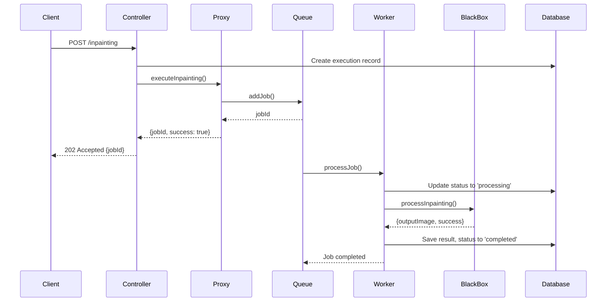

# Advanced Programming Project - Inpainting API

## Overview
This is an advanced Node.js/TypeScript application that provides an **Image Inpainting API** using a **queue-based architecture** with **BullMQ**. The application implements several design patterns including **Proxy**, **Singleton**, **Factory**, and **Repository** patterns to create a scalable and maintainable image processing service.

## Architecture Overview

The project follows a **layered architecture** with clear separation of concerns:

```
┌─────────────────┐    ┌──────────────────┐    ┌─────────────────┐
│   Controllers   │───►│      Proxy       │───►│      Queue      │
└─────────────────┘    └──────────────────┘    └─────────────────┘
                                                         │
┌─────────────────┐    ┌──────────────────┐    ┌─────────────────┐
│   Repository    │    │     Logger       │    │     Worker      │
└─────────────────┘    └──────────────────┘    └─────────────────┘
                                                         │
┌─────────────────┐                              ┌─────────────────┐
│    Database     │                              │   BlackBox      │
└─────────────────┘                              └─────────────────┘
```

## Project Structure
```
src/
├── app.ts                          # Main application entry point
├── controllers/
│   ├── userController.ts           # User authentication & management
│   └── executionController.ts      # Inpainting execution management
├── services/
│   └── blackBox.ts                 # Core inpainting service (Sharp implementation)
├── proxy/
│   └── blackBoxProxy.ts           # Proxy pattern for queue management
├── queue/
│   └── inpaintingQueue.ts         # BullMQ queue configuration
├── workers/
│   └── inpaintingWorker.ts        # Background job processor
├── repository/
│   ├── userRepository.ts          # User data access layer
│   └── executionRepository.ts     # Execution data access layer
├── middleware/
│   ├── authMiddleware.ts          # JWT authentication
│   ├── rateLimitMiddleware.ts     # Rate limiting
│   └── uploadMiddleware.ts        # File upload handling
├── factory/
│   └── loggerFactory.ts           # Logger factory pattern
├── utils/
│   ├── loggerDecorator.ts         # Decorator pattern for logging
│   ├── jwtUtils.ts                # JWT utilities
│   └── validationUtils.ts         # Input validation
├── routes/
│   ├── userRoutes.ts              # User API routes
│   └── executionRoutes.ts         # Execution API routes
├── models/
│   ├── User.ts                    # User entity model
│   └── Execution.ts               # Execution entity model
└── database/
    └── connection.ts               # Database connection setup
```

## How It Works

### 1. Request Flow
```
Client Request → Controller → Proxy → Queue → Worker → BlackBox → Database
```

### 2. Core Components

#### **Controllers Layer**
- **ExecutionController**: Handles HTTP requests for inpainting operations
- **UserController**: Manages user authentication and registration
- Implements proper error handling and logging
- Returns appropriate HTTP status codes

#### **Proxy Pattern**
- **BlackBoxProxy**: Acts as an intermediary between controllers and the queue system
- Validates requests before queuing
- Provides unified interface for different request types (processing/preview)
- Handles error cases gracefully

#### **Queue System (BullMQ)**
- **InpaintingQueue**: Manages job queuing with Redis backend
- Supports job priorities (preview jobs have higher priority)
- Implements retry mechanisms with exponential backoff
- Provides job status tracking

#### **Worker Process**
- **InpaintingWorker**: Background processor that handles queued jobs
- Updates job progress in real-time
- Communicates with BlackBox service
- Updates database with results
- Handles failures and retries

#### **BlackBox Service**
- **BlackBoxService**: Core image processing using Sharp library
- Implements actual inpainting algorithms
- Handles image format conversions
- Provides both processing and preview modes

#### **Repository Pattern**
- **ExecutionRepository**: Data access layer for executions
- **UserRepository**: Data access layer for users
- Implements singleton pattern
- Provides clean database abstraction

#### **Factory Pattern**
- **LoggerFactory**: Creates different types of loggers
- **ApiLogger**: Logs API requests/responses
- **ExecutionLogger**: Logs execution-specific events
- **ErrorLogger**: Logs errors and exceptions

### 3. Design Patterns Used

#### **Singleton Pattern**
- All services, repositories, and proxy classes use singleton pattern
- Ensures single instance throughout application lifecycle
- Memory efficient and provides consistent state

#### **Proxy Pattern**
- BlackBoxProxy controls access to the BlackBox service
- Adds queuing layer without changing client code
- Provides additional validation and error handling

#### **Factory Pattern**
- LoggerFactory creates appropriate logger instances
- Centralizes logger creation logic
- Easy to extend with new logger types

#### **Repository Pattern**
- Abstracts database operations
- Provides clean separation between business logic and data access
- Easy to test and mock

#### **Decorator Pattern**
- Logger decorators add functionality to base loggers
- Route-specific logging without modifying core logic

### 4. API Endpoints

#### **User Management Endpoints**
- `POST /api/users/register` - User registration
- `POST /api/users/login` - User login
- `GET /api/users/profile` - Get current user profile (protected)
- `GET /api/users/:userId` - Get user by ID (protected, requires authorization)
- `PUT /api/users/:userId` - Update user data (protected, requires authorization)
- `DELETE /api/users/:userId` - Delete user (protected, requires authorization)

#### **Execution Management Endpoints**
- `POST /api/executions/` - Submit inpainting job (protected)
- `POST /api/executions/preview` - Generate preview (no auth required)
- `GET /api/executions/:id` - Get execution basic info with user details (protected)
- `GET /api/executions/user` - Get current user's executions (protected) 
- `PUT /api/executions/:id` - Update execution (protected)
- `DELETE /api/executions/:id` - Delete execution (protected)
- `GET /api/executions/:id/download` - Get download URL for result image (protected)
- `GET /api/executions/:id/status` - Get execution status (protected)
- `GET /api/executions/job/:jobId/status` - Get job status by jobId (protected)

#### **Dataset Management Endpoints**
- `POST /api/datasets/create-empty` - Create an empty dataset (protected)
- `POST /api/datasets/upload-data` - Upload and process data to dataset (protected)
- `GET /api/datasets/` - Get all user datasets (protected)
- `GET /api/datasets/:name` - Get specific dataset info (protected)
- `GET /api/datasets/:name/data` - Get dataset contents with viewable image URLs (protected)
- `GET /api/datasets/image/:token` - View dataset images directly (temporary token access)
- `DELETE /api/datasets/:name` - Delete dataset (protected)

### 5. Queue Processing Flow



### 6. Technology Stack

#### **Backend**
- **Node.js** with **TypeScript** for type safety
- **Express.js** for REST API
- **BullMQ** for queue management
- **Redis** for queue storage and caching
- **Sharp** for image processing
- **SQLite/PostgreSQL** for data persistence

#### **Security & Middleware**
- **JWT** for authentication
- **bcrypt** for password hashing
- **express-rate-limit** for rate limiting
- **multer** for file uploads
- **helmet** for security headers

#### **Development Tools**
- **nodemon** for development
- **ESLint** for code linting
- **Prettier** for code formatting
- **Docker** for containerization

### 7. Environment Variables
```env
# Server Configuration
PORT=3000
NODE_ENV=development

# Database Configuration
DB_HOST=localhost
DB_PORT=5432
DB_NAME=inpainting_db
DB_USER=username
DB_PASS=password

# Redis Configuration
REDIS_HOST=localhost
REDIS_PORT=6379

# JWT Configuration
JWT_SECRET=your_secret_key
JWT_EXPIRES_IN=24h

# Worker Configuration
WORKER_CONCURRENCY=5

# File Upload
MAX_FILE_SIZE=10485760
UPLOAD_DIR=./uploads
```

### 8. Getting Started

#### **Prerequisites**
- Node.js (v18+ recommended)
- Redis server
- Database (SQLite/PostgreSQL)
- npm or yarn

#### **Installation**
```bash
# Clone repository
git clone <repository-url>
cd progetto-programmazione-avanzata

# Install dependencies
npm install

# Setup environment
cp .env.example .env
# Edit .env with your configuration

# Build TypeScript
npm run build

# Run database migrations (if applicable)
npm run migrate

# Start Redis server
redis-server

# Start the application
npm run dev

# Start worker process (in separate terminal)
npm run worker
```

#### **Docker Setup**
```bash
# Build and start all services
docker-compose up --build

# Start in detached mode
docker-compose up -d

# View logs
docker-compose logs -f

# Stop services
docker-compose down
```

### 9. Come Usare l'API con Postman - Guida Dettagliata

#### **Setup Iniziale Postman**
1. Crea una nuova Collection chiamata "Inpainting API"
2. Aggiungi una variabile d'ambiente `{{baseUrl}}` con valore `http://localhost:3000`
3. Aggiungi una variabile `{{authToken}}` che verrà popolata automaticamente

#### **Passo 1: Registrazione Utente**
```http
POST {{baseUrl}}/api/users/register
Content-Type: application/json

{
    "email": "test@example.com",
    "password": "password123",
    "name": "Test User"
}
```
{
    "name": "gir",
    "surname": "Test User",
    "email": "1test@example.com",
    "password": "password123"
    
}

**Risposta Attesa:**
```json
{
    "success": true,
    "message": "User registered successfully",
    "data": {
        "id": 1,
        "email": "test@example.com",
        "name": "Test User"
    }
}
```

#### **Passo 2: Login e Ottenimento Token**
```http
POST {{baseUrl}}/api/users/login
Content-Type: application/json

{
    "email": "test@example.com",
    "password": "password123"
}
```

**Risposta Attesa:**
```json
{
    "success": true,
    "message": "Login successful",
    "data": {
        "token": "eyJhbGciOiJIUzI1NiIsInR5cCI6IkpXVCJ9...",
        "user": {
            "id": 1,
            "email": "test@example.com",
            "name": "Test User"
        }
    }
}
```

**Script Post-Response in Postman:**
```javascript
if (pm.response.code === 200) {
    const response = pm.response.json();
    pm.environment.set("authToken", response.data.token);
    pm.environment.set("userId", response.data.user.id);
}
```

#### **Passo 3: Verificare Autenticazione**
```http
GET {{baseUrl}}/api/users/profile
Authorization: Bearer {{authToken}}
```

**Risposta Attesa:**
```json
{
    "success": true,
    "data": {
        "id": 1,
        "name": "Test User",
        "surname": "Test User",
        "email": "test@example.com",
        "createdAt": "2024-01-15T10:30:00Z"
    }
}
```

**Note Importanti:**
- L'endpoint `/api/users/profile` restituisce il profilo dell'utente autenticato (dal token JWT)
- L'endpoint `/api/users/:userId` richiede un ID specifico nei parametri URL
- Entrambi richiedono autenticazione Bearer token

#### **Passo 4: Creare un Job di Inpainting**
```http
POST {{baseUrl}}/api/executions/
Authorization: Bearer {{authToken}}
Content-Type: multipart/form-data

Key: originalImage | Type: File | Value: [Seleziona immagine JPG/PNG]
Key: maskImage     | Type: File | Value: [Seleziona immagine mask]
Key: userId        | Type: Text | Value: {{userId}}
Key: description   | Type: Text | Value: "Test inpainting"
```

**Risposta Attesa:**
```json
{
    "success": true,
    "message": "Inpainting job queued successfully",
    "data": {
        "jobId": "job_12345",
        "executionId": 1,
        "status": "queued",
        "queuePosition": 1
    }
}
```

**Script Post-Response:**
```javascript
if (pm.response.code === 202) {
    const response = pm.response.json();
    pm.environment.set("jobId", response.data.jobId);
    pm.environment.set("executionId", response.data.executionId);
}
```

#### **Passo 5: Monitorare lo Stato del Job**
```http
GET {{baseUrl}}/api/executions/job/{{jobId}}/status
Authorization: Bearer {{authToken}}
```

**Log Output Atteso:**
Quando esegui questa richiesta, dovresti vedere nei log dell'applicazione:

```
[2024-01-15T10:35:00.123Z] [INFO]: API_REQUEST: GET /api/executions/job/12345/status | Data: {"userId":1,"ip":"127.0.0.1","userAgent":"PostmanRuntime/7.32.3"}
[2024-01-15T10:35:00.125Z] [INFO]: EXECUTION_ACTION: JOB_STATUS_CHECK_REQUESTED | Data: {"jobId":"12345","userId":1,"timestamp":"2024-01-15T10:35:00.125Z"}
🔍 Checking status for job: 12345 by user: 1
[2024-01-15T10:35:00.128Z] [INFO]: EXECUTION_ACTION: JOB_STATUS_RETRIEVED | Data: {"jobId":"12345","userId":1,"status":"completed","progress":100,"timestamp":"2024-01-15T10:35:00.128Z"}
✅ Job status retrieved for 12345: completed (100%)
[2024-01-15T10:35:00.130Z] [INFO]: API_RESPONSE: GET /api/executions/job/12345/status - 200 | Data: {"userId":1,"statusCode":200,"executionTime":7}
```

### Video Processing
1. Group frames by `uploadIndex` (video identifier)
2. Sort frames by `frameIndex` within each group
3. Process each frame individually
4. Reconstruct video from processed frames **at 1 FPS** (matching original sampling)
5. Output MP4 video file with same duration as original

**Log Esempio:**
```
[INFO] Starting dataset processing for user: user-uuid
[INFO] Processing single image: datasets/user/image1.jpg
[INFO] Processing video frames for video ID: 1
[INFO] Video processing completed: 30 frames → inferences/user/video_1.mp4 (30s @ 1 FPS)
[INFO] Dataset processing completed. Images: 5, Videos: 2
```

**In caso di Job Non Trovato:**
```
[2024-01-15T10:35:00.123Z] [INFO]: API_REQUEST: GET /api/executions/job/invalid123/status
[2024-01-15T10:35:00.125Z] [INFO]: EXECUTION_ACTION: JOB_STATUS_CHECK_REQUESTED | Data: {"jobId":"invalid123","userId":1,"timestamp":"2024-01-15T10:35:00.125Z"}
🔍 Checking status for job: invalid123 by user: 1
[2024-01-15T10:35:00.127Z] [ERROR]: JOB_NOT_FOUND | Data: {"jobId":"invalid123","userId":1,"timestamp":"2024-01-15T10:35:00.127Z"}
❌ Job not found: invalid123
```

**In caso di Errore del Sistema:**
```
[2024-01-15T10:35:00.123Z] [INFO]: API_REQUEST: GET /api/executions/job/12345/status
[2024-01-15T10:35:00.125Z] [ERROR]: DATABASE_ERROR | Data: {"operation":"GET_JOB_STATUS","table":"queue","error":"Redis connection failed"}
[2024-01-15T10:35:00.126Z] [ERROR]: JOB_STATUS_ERROR | Data: {"jobId":"12345","userId":1,"error":"Redis connection failed","timestamp":"2024-01-15T10:35:00.126Z"}
❌ Error checking job status for 12345: Redis connection failed
```

#### **Passo 6: Scaricare il Risultato**
```http
GET {{baseUrl}}/api/executions/{{executionId}}/download
Authorization: Bearer {{authToken}}
```

**Possibili Risposte:**

**✅ Successo (Execution Completata e Autorizzata):**
- Status: `200 OK`
- Content-Type: `application/json`
- Body: JSON con URL di download
```json
{
    "success": true,
    "message": "Download URL generated successfully",
    "data": {
        "executionId": 1,
        "imageUrl": "/static/images/execution_1_user_1_1642251600000.png",
        "imageSize": 245680,
        "status": "completed"
    }
}
```

**⏳ Execution in Pending:**
- Status: `202 Accepted`
```json
{
    "success": false,
    "message": "Execution is still pending. Please wait for processing to complete.",
    "data": {
        "executionId": 1,
        "status": "pending",
        "createdAt": "2024-01-15T10:30:00Z",
        "updatedAt": "2024-01-15T10:30:00Z"
    }
}
```

**⚙️ Execution in Processing:**
- Status: `202 Accepted`
```json
{
    "success": false,
    "message": "Execution is currently being processed. Please try again in a few moments.",
    "data": {
        "executionId": 1,
        "status": "processing",
        "createdAt": "2024-01-15T10:30:00Z",
        "updatedAt": "2024-01-15T10:32:00Z"
    }
}
```

**❌ Execution Fallita:**
- Status: `422 Unprocessable Entity`
```json
{
    "success": false,
    "message": "Execution has failed. No result image is available.",
    "data": {
        "executionId": 1,
        "status": "failed",
        "createdAt": "2024-01-15T10:30:00Z",
        "updatedAt": "2024-01-15T10:35:00Z",
        "error": "Processing failed"
    }
}
```

**🚫 Execution Non Trovata:**
- Status: `404 Not Found`
```json
{
    "success": false,
    "message": "Execution not found",
    "data": {
        "executionId": 999,
        "status": "not_found"
    }
}
```

**🔒 Accesso Negato (Non Proprietario):**
- Status: `403 Forbidden`
```json
{
    "success": false,
    "message": "Access denied: You can only download your own executions",
    "data": {
        "executionId": 1,
        "status": "access_denied"
    }
}
```

**📸 Immagine Risultato Mancante:**
- Status: `404 Not Found`
```json
{
    "success": false,
    "message": "Result image not found or corrupted. Please try regenerating the execution.",
    "data": {
        "executionId": 1,
        "status": "completed",
        "error": "Output image missing"
    }
}
```

**Log Output per Download Autorizzato:**
```
[2024-01-15T10:40:00.123Z] [INFO]: API_REQUEST: GET /api/executions/1/download | Data: {"userId":1,"ip":"127.0.0.1"}
[2024-01-15T10:40:00.125Z] [INFO]: EXECUTION_ACTION: EXECUTION_DOWNLOADED | Data: {"executionId":1,"userId":1}
[2024-01-15T10:40:00.127Z] [INFO]: EXECUTION_ACTION: DOWNLOAD_ATTEMPT | Data: {"executionId":1,"userId":1,"timestamp":"2024-01-15T10:40:00.127Z"}
🔍 Download attempt for execution 1 by user 1
📊 Execution 1 status: completed
[2024-01-15T10:40:00.130Z] [INFO]: EXECUTION_ACTION: DOWNLOAD_SUCCESS | Data: {"executionId":1,"userId":1,"status":"completed","imageSize":245680,"timestamp":"2024-01-15T10:40:00.130Z"}
✅ Successfully serving download for execution 1 (245680 bytes)
```

**Log Output per Accesso Negato:**
```
[2024-01-15T10:40:00.123Z] [INFO]: API_REQUEST: GET /api/executions/5/download
🔍 Download attempt for execution 5 by user 1
[2024-01-15T10:40:00.127Z] [ERROR]: AUTHORIZATION_ERROR | Data: {"userId":1,"resource":"execution_5"}
[2024-01-15T10:40:00.128Z] [ERROR]: DOWNLOAD_ACCESS_DENIED | Data: {"executionId":5,"userId":1,"ownerId":2,"timestamp":"2024-01-15T10:40:00.128Z"}
❌ User 1 not authorized to download execution 5 (owned by 2)
```

**Sicurezza e Autorizzazione:**

1. **Token JWT Obbligatorio**: Tutti i download richiedono autenticazione
2. **Controllo Proprietà**: L'utente può scaricare solo le proprie executions
3. **Logging Completo**: Tutti i tentativi di accesso vengono registrati
4. **Validation del Status**: Controllo dello stato prima del download
5. **Error Handling Dettagliato**: Messaggi specifici per ogni scenario

**Come Testare l'Autorizzazione in Postman:**

1. **Test Download Autorizzato:**
   - Usa il token dell'utente proprietario
   - Usa `{{executionId}}` di una tua execution
   - Aspettati download dell'immagine o messaggio di stato

2. **Test Accesso Negato:**
   - Crea due utenti diversi
   - Con il primo utente crea un'execution (nota l'ID)
   - Fai login con il secondo utente
   - Prova a scaricare l'execution del primo utente
   - Aspettati `403 Forbidden`

3. **Test Senza Token:**
   - Rimuovi l'header `Authorization`
   - Aspettati `401 Unauthorized`

### 10. Come Verificare che i Design Patterns Funzionano

#### **A. Verificare il Pattern Singleton**

**Test 1: Singleton dei Repository**
```http
GET {{baseUrl}}/api/debug/singleton-test
Authorization: Bearer {{authToken}}
```

Questo endpoint (da implementare per il debug) dovrebbe mostrare:
```json
{
    "userRepositoryInstances": 1,
    "executionRepositoryInstances": 1,
    "message": "Singleton pattern working correctly"
}
```

**Test nei Log:**
Cerca nei log dell'applicazione:
```
[DEBUG] UserRepository instance created: <memory_address>
[DEBUG] UserRepository instance retrieved: <same_memory_address>
```

#### **B. Verificare il Pattern Proxy**

**Test 2: Proxy Intercepting Requests**
```http
POST {{baseUrl}}/api/executions/inpainting
Authorization: Bearer {{authToken}}
Content-Type: multipart/form-data

Key: originalImage | Type: File | Value: [File corrotto]
Key: maskImage     | Type: File | Value: [File valido]
Key: userId        | Type: Text | Value: {{userId}}
```

**Comportamento Atteso:**
Il Proxy dovrebbe intercettare e validare prima di passare alla coda:
```json
{
    "success": false,
    "message": "Invalid image format detected by proxy",
    "error": "Proxy validation failed"
}
```

**Test nei Log:**
```
[INFO] BlackBoxProxy: Validating request before queuing
[WARN] BlackBoxProxy: Invalid image detected, request blocked
```

#### **C. Verificare il Pattern Factory**

**Test 3: Factory Creating Different Loggers**
Controlla i log dell'applicazione durante le varie operazioni:

```
[API-LOG] 2024-01-15T10:30:00Z POST /api/executions/inpainting
[EXECUTION-LOG] 2024-01-15T10:30:05Z Execution 1 started processing
[ERROR-LOG] 2024-01-15T10:30:10Z Queue connection failed
```

Ogni tipo di log dovrebbe avere un formato diverso, indicando che il Factory sta creando logger specifici.

#### **D. Verificare il Pattern Repository**

**Test 4: Repository Abstraction**
```http
GET {{baseUrl}}/api/executions/user/{{userId}}
Authorization: Bearer {{authToken}}
```

**Verifica nei Log:**
```
[DEBUG] ExecutionRepository: findByUserId called
[DEBUG] Database query executed: SELECT * FROM executions WHERE user_id = ?
[DEBUG] Repository returned 3 executions
```

### 11. Test di Carico e Performance con Postman

#### **Test di Carico Semplice**
1. Crea una Collection con multiple richieste di inpainting
2. Usa il Collection Runner di Postman
3. Imposta 10 iterazioni con delay di 1 secondo
4. Monitora come la coda gestisce i job multipli

#### **Test del Rate Limiting**
```http
POST {{baseUrl}}/api/executions/inpainting
Authorization: Bearer {{authToken}}
```
Esegui rapidamente 20 volte. Dopo il limite (es. 10 richieste/minuto) dovresti ricevere:
```json
{
    "success": false,
    "message": "Too many requests",
    "retryAfter": 60
}
```

### 12. Debugging e Monitoraggio in Tempo Reale

#### **Endpoint di Debug (Solo per Development)**
```http
GET {{baseUrl}}/api/debug/queue-status
Authorization: Bearer {{authToken}}
```

**Risposta:**
```json
{
    "waiting": 3,
    "active": 2,
    "completed": 15,
    "failed": 1,
    "workers": {
        "active": 2,
        "total": 5
    }
}
```

#### **Monitoring dei Pattern**
```http
GET {{baseUrl}}/api/debug/patterns-status
Authorization: Bearer {{authToken}}
```

**Risposta:**
```json
{
    "patterns": {
        "singleton": {
            "userRepository": "active",
            "executionRepository": "active",
            "instances": 1
        },
        "proxy": {
            "requestsIntercepted": 45,
            "validationsPassed": 42,
            "validationsFailed": 3
        },
        "factory": {
            "apiLoggers": 1,
            "executionLoggers": 1,
            "errorLoggers": 1
        },
        "repository": {
            "queries": 128,
            "cacheHits": 45,
            "cacheMisses": 83
        }
    }
}
```

### 13. Workflow Completo di Test

#### **Scenario 1: Utente Nuovo**
1. **Registrazione** → Verifica risposta 201
2. **Login** → Salva token
3. **Profile** → Verifica autenticazione
4. **Inpainting** → Invia job
5. **Monitor** → Controlla stato ogni 5 secondi
6. **Download** → Scarica risultato

#### **Scenario 2: Test dei Pattern**
1. **Multiple Login** → Verifica Singleton
2. **Invalid Image** → Verifica Proxy
3. **Check Logs** → Verifica Factory
4. **Database Queries** → Verifica Repository

#### **Scenario 3: Test di Stress**
1. **Burst Requests** → Test rate limiting
2. **Large Files** → Test upload limits
3. **Queue Overflow** → Test queue management

### 14. License
This project is licensed under the MIT License - see the LICENSE file for details.

### 15. Troubleshooting Comune

#### **Errore: "Queue connection failed"**
- Verifica che Redis sia in esecuzione
- Controlla le variabili d'ambiente REDIS_HOST e REDIS_PORT

#### **Errore: "Token expired"**
- Rifare il login per ottenere un nuovo token
- Controlla JWT_EXPIRES_IN nelle variabili d'ambiente

#### **Errore: "File too large"**
- Controlla MAX_FILE_SIZE nelle variabili d'ambiente
- Riduci la dimensione dell'immagine

#### **Job rimane in "waiting"**
- Verifica che il worker sia in esecuzione (`npm run worker`)
- Controlla i log del worker per errori

#### **Pattern non funzionano**
- Controlla che l'applicazione sia compilata (`npm run build`)
- Verifica i log per errori di inizializzazione
- Riavvia l'applicazione per ripristinare i Singleton

### 16. Dataset Management System - Guida Completa

Il sistema di gestione dataset supporta la creazione, caricamento e visualizzazione di dataset per training di modelli di inpainting.

#### **Creazione e Gestione Dataset**

##### **Passo 1: Creare un Dataset Vuoto**
```http
POST {{baseUrl}}/api/datasets/create-empty
Authorization: Bearer {{authToken}}
Content-Type: application/json

{
    "name": "my-training-dataset",
    "tags": ["segmentation", "medical", "training"]
}
```

**Campi della Richiesta:**
- `name` (string, obbligatorio): Nome del dataset (deve essere unico per utente)
- `tags` (array, opzionale): Tag per categorizzare il dataset

**Risposta Attesa:**
```json
{
    "message": "Empty dataset created successfully",
    "dataset": {
        "userId": "user123",
        "name": "my-training-dataset",
        "data": null,
        "tags": ["segmentation", "medical", "training"],
        "isDeleted": false,
        "createdAt": "2024-01-15T10:30:00Z",
        "updatedAt": "2024-01-15T10:30:00Z"
    }
}
```

##### **Passo 2: Caricare Dati nel Dataset**

Il sistema supporta diversi tipi di caricamento dati:

###### **Opzione A: Caricamento Immagine + Maschera**
```http
POST {{baseUrl}}/api/datasets/upload-data
Authorization: Bearer {{authToken}}
Content-Type: multipart/form-data

Key: datasetName | Type: Text | Value: my-training-dataset
Key: image       | Type: File | Value: [Seleziona immagine JPG/PNG]
Key: mask        | Type: File | Value: [Seleziona maschera PNG binaria]
```

**Requisiti per le Immagini:**
- **Immagine**: JPG, JPEG, PNG (max 500MB)
- **Maschera**: PNG binaria (solo pixel neri e bianchi)

**Esempi di File Supportati:**
- `image.jpg` + `mask.png`
- `photo.jpeg` + `binary_mask.png`

###### **Opzione B: Caricamento Video + Maschera**
```http
POST {{baseUrl}}/api/datasets/upload-data
Authorization: Bearer {{authToken}}
Content-Type: multipart/form-data

Key: datasetName | Type: Text | Value: my-video-dataset
Key: image       | Type: File | Value: [Video MP4/AVI/MOV]
Key: mask        | Type: File | Value: [Immagine PNG maschera]
```

**Come Funziona:**
- Il sistema estrae 1 frame per secondo dal video
- Applica la stessa maschera a tutti i frame estratti
- Salva ogni frame come coppia immagine-maschera
- **Durante l'inferenza, ricostruisce il video a 1 FPS** (ogni frame dura 1 secondo)

**Esempio Pratico:**
- Video di 10 secondi → 10 frame estratti → 10 coppie nel dataset → Video output di 10 secondi a 1 FPS
- Video di 30 secondi → 30 frame estratti → 30 coppie nel dataset → Video output di 30 secondi a 1 FPS

###### **Opzione C: Caricamento Video + Video Maschera**
```http
POST {{baseUrl}}/api/datasets/upload-data
Authorization: Bearer {{authToken}}
Content-Type: multipart/form-data

Key: datasetName | Type: Text | Value: my-complex-dataset
Key: image       | Type: File | Value: [Video principale MP4]
Key: mask        | Type: File | Value: [Video maschera MP4]
```

**Requisiti Speciali:**
- Entrambi i video devono avere la **stessa durata**
- Stesso numero di frame (stesso FPS)
- Video maschera deve contenere solo frame binari

**Errori Comuni:**
```json
// Video con durata diversa
{
    "success": false,
    "error": "Video and mask video must have the same number of frames. Video: 10 frames, Mask: 9 frames"
}
```

###### **Opzione D: Caricamento File ZIP**
```http
POST {{baseUrl}}/api/datasets/upload-data
Authorization: Bearer {{authToken}}
Content-Type: multipart/form-data

Key: datasetName | Type: Text | Value: my-zip-dataset
Key: image       | Type: File | Value: [File ZIP con struttura organizzata]
Key: mask        | Type: File | Value: [Qualsiasi file - verrà ignorato per ZIP]
```

**Struttura ZIP Supportata:**
```
dataset.zip
├── category1/
│   ├── image1.jpg
│   ├── image2.png
│   ├── mask1.png        # File con "mask" nel nome
│   └── mask2.png
├── category2/
│   ├── photo1.jpg
│   ├── photo2.png
│   └── masks/           # Cartella "masks"
│       ├── mask1.png
│       └── mask2.png
└── category3/
    ├── video1.mp4       # Supporta anche video in ZIP
    ├── video2.mp4
    ├── mask_video1.mp4  # Video maschera
    └── single_mask.png  # Maschera singola per video
```

**Regole di Associazione ZIP:**
1. **Per Nome**: File con "mask" nel nome vengono considerati maschere
2. **Per Cartella**: File nella cartella "masks/" vengono considerati maschere
3. **Associazione Automatica**: Ogni immagine viene abbinata con tutte le maschere della stessa categoria

**Risposta per Tutti i Tipi:**
```json
{
    "message": "Data uploaded and processed successfully",
    "processedItems": 15
}
```

#### **Visualizzazione e Navigazione Dataset**

##### **1. Visualizzare tutti i tuoi dataset**
```http
GET {{baseUrl}}/api/datasets/
Authorization: Bearer {{authToken}}
```

**Risposta:**
```json
{
    "success": true,
    "message": "Datasets retrieved successfully",
    "data": [
        {
            "userId": "user123",
            "name": "my-training-dataset",
            "tags": ["segmentation", "medical"],
            "createdAt": "2024-01-15T10:30:00Z",
            "updatedAt": "2024-01-15T10:35:00Z",
            "itemCount": 25,        // Numero totale di coppie immagine-maschera
            "type": "video-frames"  // "image-mask" o "video-frames"
        }
    ]
}
```

##### **2. Visualizzare contenuti dataset con paginazione**
```http
GET {{baseUrl}}/api/datasets/my-training-dataset/data?page=2&limit=5
Authorization: Bearer {{authToken}}
```

**Parametri di Paginazione:**
- `page` (numero): Pagina da visualizzare (default: 1)
- `limit` (numero): Elementi per pagina (default: 10, max: 50)

**Risposta con URL delle Immagini:**
```json
{
    "success": true,
    "message": "Dataset data retrieved successfully",
    "data": {
        "name": "my-training-dataset",
        "type": "video-frames",
        "totalItems": 25,
        "currentPage": 2,
        "totalPages": 5,        // 25 ÷ 5 = 5 pagine
        "itemsPerPage": 5,
        "items": [
            {
                "index": 5,         // Indice globale
                "imagePath": "datasets/user123/my-dataset/frame_005.png",
                "maskPath": "datasets/user123/my-dataset/mask.png",
                "imageUrl": "http://localhost:3000/api/datasets/image/temp_token_123...",
                "maskUrl": "http://localhost:3000/api/datasets/image/temp_token_456...",
                "frameIndex": 5     // Solo per video-frames
            }
            // ... altri 4 elementi
        ]
    }
}
```

##### **3. Navigazione tra Pagine**
```http
# Prima pagina (elementi 0-4)
GET {{baseUrl}}/api/datasets/my-dataset/data?page=1&limit=5

# Seconda pagina (elementi 5-9)
GET {{baseUrl}}/api/datasets/my-dataset/data?page=2&limit=5

# Ultima pagina
GET {{baseUrl}}/api/datasets/my-dataset/data?page=5&limit=5
```

##### **4. Visualizzare Immagini Direttamente**
Le URL generate (`imageUrl` e `maskUrl`) possono essere aperte direttamente nel browser:

**Caratteristiche degli URL:**
- ✅ **Nessun Bearer Token richiesto** nell'URL
- ✅ **Token temporanei** (1 ora di validità)
- ✅ **Sicurezza**: Solo il proprietario può generare i token
- ✅ **Cache-friendly**: Le immagini vengono cachate

**Esempio in HTML:**
```html

```

#### **Workflow Completo: Creare e Popolare un Dataset**

##### **Scenario 1: Dataset di Immagini Mediche**

**Step 1: Creare Dataset**
```http
POST {{baseUrl}}/api/datasets/create-empty
Authorization: Bearer {{authToken}}
Content-Type: application/json

{
    "name": "medical-segmentation",
    "tags": ["medical", "segmentation", "lungs"]
}
```

**Step 2: Caricare Prima Coppia**
```http
POST {{baseUrl}}/api/datasets/upload-data
Authorization: Bearer {{authToken}}
Content-Type: multipart/form-data

Key: datasetName | Type: Text | Value: medical-segmentation
Key: image       | Type: File | Value: lung_scan_001.jpg
Key: mask        | Type: File | Value: lung_mask_001.png
```

**Step 3: Caricare Altre Coppie**
Ripeti lo Step 2 con altre immagini. Ogni caricamento aggiunge elementi al dataset esistente.

**Step 4: Verificare Contenuto**
```http
GET {{baseUrl}}/api/datasets/medical-segmentation/data
Authorization: Bearer {{authToken}}
```

##### **Scenario 2: Dataset da Video Sorveglianza**

**Step 1: Creare Dataset**
```http
POST {{baseUrl}}/api/datasets/create-empty
Authorization: Bearer {{authToken}}
Content-Type: application/json

{
    "name": "surveillance-detection",
    "tags": ["surveillance", "object-detection", "security"]
}
```

**Step 2: Processare Video**
```http
POST {{baseUrl}}/api/datasets/upload-data
Authorization: Bearer {{authToken}}
Content-Type: multipart/form-data

Key: datasetName | Type: Text | Value: surveillance-detection
Key: image       | Type: File | Value: surveillance_video_30sec.mp4
Key: mask        | Type: File | Value: person_mask.png
```

**Come Funziona:**
- Il sistema estrae 1 frame per secondo dal video
- Applica la stessa maschera a tutti i frame estratti
- Salva ogni frame come coppia immagine-maschera
- **Durante l'inferenza, ricostruisce il video a 1 FPS** (ogni frame dura 1 secondo)

**Esempio Pratico:**
- Video di 10 secondi → 10 frame estratti → 10 coppie nel dataset → Video output di 10 secondi a 1 FPS
- Video di 30 secondi → 30 frame estratti → 30 coppie nel dataset → Video output di 30 secondi a 1 FPS

**Step 3: Verificare Contenuto**
```http
GET {{baseUrl}}/api/datasets/surveillance-detection/data
Authorization: Bearer {{authToken}}
```

##### **Scenario 3: Dataset Complesso da ZIP**

**Step 1: Preparare ZIP**
```
training_data.zip
├── indoor/
│   ├── room1.jpg
│   ├── room2.jpg
│   ├── mask_room1.png
│   └── mask_room2.png
├── outdoor/
│   ├── street1.jpg
│   ├── street2.jpg
│   └── masks/
│       ├── street1_mask.png
│       └── street2_mask.png
└── mixed/
    ├── video_sequence.mp4
    └── universal_mask.png
```

**Step 2: Caricare ZIP**
```http
POST {{baseUrl}}/api/datasets/upload-data
Authorization: Bearer {{authToken}}
Content-Type: multipart/form-data

Key: datasetName | Type: Text | Value: complex-training-set
Key: image       | Type: File | Value: training_data.zip
Key: mask        | Type: File | Value: [Qualsiasi file - ignorato]
```

**Risultato**: 
- 4 coppie immagine-maschera dalle cartelle indoor/outdoor
- N coppie dal video processato in mixed/

#### **Gestione Errori e Best Practices**

##### **Errori Comuni e Soluzioni**

**1. Nome Dataset Duplicato**
```json
{
    "success": false,
    "error": "Dataset with this name already exists"
}
```
**Soluzione**: Usa un nome diverso per il dataset.

**2. Maschera Non Binaria**
```json
{
    "success": false,
    "error": "Mask must be a binary image"
}
```
**Soluzione**: Converti la maschera in bianco e nero puro (0 e 255).

**3. File Troppo Grande**
```json
{
    "success": false,
    "error": "File too large"
}
```
**Soluzione**: Riduci dimensione file o comprimi il video.

**4. FFmpeg Non Disponibile**
```json
{
    "success": false,
    "error": "FFmpeg is not available"
}
```
**Soluzione**: Usa solo immagini o controlla installazione Docker.

##### **Best Practices**

**Nomi Dataset:**
- Usa nomi descrittivi: `medical-ct-scans` invece di `dataset1`
- Include versioni: `traffic-v2`, `faces-augmented-v3`

**Tag Organizzazione:**
- Domain: `medical`, `automotive`, `surveillance`
- Type: `segmentation`, `detection`, `classification`  
- Status: `training`, `validation`, `test`

**File Preparation:**
- **Immagini**: Usa PNG per qualità, JPG per dimensioni ridotte
- **Maschere**: Sempre PNG, rigorosamente binarie
- **Video**: Preferisci MP4 con codec H.264
- **ZIP**: Organizza in sottocartelle logiche

**Paginazione Strategica:**
- Dataset piccoli (< 50): `limit=50` (una pagina)
- Dataset medi (50-200): `limit=20`
- Dataset grandi (> 200): `limit=10` per performance

#### **Script Postman per Automazione**

##### **Collection Variables Setup**
```javascript
// In Pre-request Script della Collection
pm.globals.set("baseUrl", "http://localhost:3000");
```

##### **Script Post-Login**
```javascript
// In Post-response del login
if (pm.response.code === 200) {
    const response = pm.response.json();
    pm.environment.set("authToken", response.data.token);
    pm.environment.set("userId", response.data.user.userId);
}
```

##### **Script Post-Dataset Creation**
```javascript
// In Post-response della creazione dataset
if (pm.response.code === 201) {
    const response = pm.response.json();
    pm.environment.set("lastDatasetName", response.dataset.name);
    console.log(`Dataset created: ${response.dataset.name}`);
}
```

##### **Script Navigazione Automatica**
```javascript
// Per navigare automaticamente tra pagine
const currentPage = parseInt(pm.environment.get("currentPage") || "1");
const totalPages = parseInt(pm.environment.get("totalPages") || "1");

if (currentPage < totalPages) {
    pm.environment.set("nextPage", currentPage + 1);
    console.log(`Next page available: ${currentPage + 1}`);
} else {
    console.log("You've reached the last page");
}
```

##### **Script per Polling Automatico:**
```javascript
// Post-response script per status check
const maxRetries = parseInt(pm.environment.get("maxRetries"));
const currentRetry = parseInt(pm.environment.get("currentRetry"));
const status = pm.response.json().data.status;

if (status === "RUNNING" && currentRetry < maxRetries) {
    // Incrementa retry counter
    pm.environment.set("currentRetry", currentRetry + 1);
    
    // Aspetta e riprova
    setTimeout(() => {
        postman.setNextRequest("Get Inference Status");
    }, 5000);
    
    console.log(`⏳ Retry ${currentRetry + 1}/${maxRetries} - Status: ${status}`);
} else if (status === "COMPLETED") {
    pm.environment.set("currentRetry", "0");
    postman.setNextRequest("Get Inference Results");
    console.log("✅ Processing completed, moving to results");
} else if (status === "FAILED" || currentRetry >= maxRetries) {
    pm.environment.set("currentRetry", "0");
    console.log("❌ Processing failed or max retries reached");
}
```

##### **Errori Comuni e Soluzioni**

**1. Dataset Vuoto**
```json
{
    "error": "Dataset is empty"
}
```
**Soluzione:** Aggiungi almeno una coppia immagine-maschera al dataset.

**2. Python Service Non Disponibile**
```json
{
    "status": "FAILED",
    "result": {
        "error": "Python service error: connect ECONNREFUSED 127.0.0.1:5000"
    }
}
```
**Soluzione:** 
- Verifica che il container `python-inference` sia running
- Controlla `docker-compose ps`
- Riavvia il servizio: `docker-compose restart python-inference`

**3. File Non Trovato Durante Processing**
```json
{
    "status": "FAILED",
    "result": {
        "error": "Could not load image: datasets/user/missing.jpg"
    }
}
```
**Soluzione:** 
- Il file è stato eliminato dopo la creazione del dataset
- Ricarica i dati nel dataset

**4. Timeout del Processing**
```json
{
    "status": "FAILED",  
    "result": {
        "error": "Python service error: timeout of 300000ms exceeded"
    }
}
```
**Soluzione:**
- Dataset troppo grande per il timeout (5 minuti)
- Dividi il dataset in parti più piccole
- Aumenta il timeout in `inferenceBlackBoxAdapter.ts`

##### **Postman Environment Setup per Inferenza**

**Variabili Ambiente Consigliate:**
```json
{
    "baseUrl": "http://localhost:3000",
    "authToken": "[populated after login]",
    "userId": "[populated after login]",
    "datasetName": "test-inference-dataset",
    "inferenceId": "[populated after creating inference]",
    "maxRetries": "10",
    "retryDelay": "5000",
    "currentRetry": "0"
}
```

**Postman Tests per Validazione:**
```javascript
// Test per verifica creazione inferenza
pm.test("Inference created successfully", function () {
    pm.response.to.have.status(201);
    pm.response.to.have.jsonBody("success", true);
    pm.response.to.have.jsonBody("inference.status", "PENDING");
});

// Test per verifica completamento
pm.test("Inference completed", function () {
    const status = pm.response.json().data.status;
    if (status === "COMPLETED") {
        pm.test("Has results", function () {
            pm.response.to.have.jsonBody("data.result");
        });
    }
});
```

Ora hai una guida completa per creare, popolare e navigare i dataset usando Postman! 📊🎯

### 17. Inference System - Guida Completa Postman

Il sistema di inferenza permette di processare interi dataset attraverso il servizio Python blackbox, generando risultati batch per immagini e video.

#### **Workflow Completo di Inferenza**

##### **Prerequisiti**
Prima di iniziare, assicurati di avere:
- Un dataset popolato con almeno una coppia immagine-maschera
- Token di autenticazione valido
- Python inference service attivo (porta 5000)

##### **Passo 1: Creare una Nuova Inferenza**
```http
POST {{baseUrl}}/api/inferences/create
Authorization: Bearer {{authToken}}
Content-Type: application/json

{
    "datasetName": "medical-segmentation",
    "modelId": "default_inpainting",
    "parameters": {
        "quality": "high",
        "blendMode": "lighten",
        "outputFormat": "png",
        "customParameter": "value"
    }
}
```

**Campi della Richiesta:**
- `datasetName` (string, obbligatorio): Nome del dataset da processare
- `modelId` (string, opzionale): ID del modello da usare (default: "default_inpainting")
- `parameters` (object, opzionale): Parametri personalizzati per il processing

**Risposta Attesa:**
```json
{
    "success": true,
    "message": "Inference created and processing started",
    "inference": {
        "id": "550e8400-e29b-41d4-a716-446655440000",
        "status": "PENDING",
        "modelId": "default_inpainting",
        "datasetName": "medical-segmentation",
        "createdAt": "2024-01-15T10:30:00.000Z"
    }
}
```

**Script Post-Response in Postman:**
```javascript
if (pm.response.code === 201) {
    const response = pm.response.json();
    pm.environment.set("inferenceId", response.inference.id);
    pm.environment.set("datasetName", response.inference.datasetName);
    console.log(`Inference created: ${response.inference.id}`);
    console.log(`Status: ${response.inference.status}`);
}
```

##### **Passo 2: Monitorare lo Stato dell'Inferenza**
```http
GET {{baseUrl}}/api/inferences/{{inferenceId}}
Authorization: Bearer {{authToken}}
```

**Stati Possibili:**
- `PENDING`: In attesa di iniziare il processing
- `RUNNING`: Processing in corso
- `COMPLETED`: Processing completato con successo
- `FAILED`: Processing fallito
- `ABORTED`: Processing interrotto

**Risposta Durante Processing (RUNNING):**
```json
{
    "success": true,
    "message": "Inference retrieved successfully",
    "data": {
        "id": "550e8400-e29b-41d4-a716-446655440000",
        "status": "RUNNING",
        "modelId": "default_inpainting",
        "parameters": {
            "quality": "high",
            "blendMode": "lighten"
        },
        "result": null,
        "datasetName": "medical-segmentation",
        "userId": "user-uuid-here",
        "createdAt": "2024-01-15T10:30:00.000Z",
        "updatedAt": "2024-01-15T10:32:15.000Z"
    }
}
```

**Risposta Processing Completato (COMPLETED):**
```json
{
    "success": true,
    "message": "Inference retrieved successfully",
    "data": {
        "id": "550e8400-e29b-41d4-a716-446655440000",
        "status": "COMPLETED",
        "modelId": "default_inpainting",
        "parameters": {
            "quality": "high",
            "blendMode": "lighten"
        },
        "result": {
            "success": true,
            "images": [
                {
                    "originalPath": "datasets/user-id/image1.jpg",
                    "outputPath": "inferences/user-id/processed_uuid_image1.png"
                },
                {
                    "originalPath": "datasets/user-id/image2.jpg", 
                    "outputPath": "inferences/user-id/processed_uuid_image2.png"
                }
            ],
            "videos": [
                {
                    "originalVideoId": "1",
                    "outputPath": "inferences/user-id/uuid_video_1.mp4"
                }
            ]
        },
        "datasetName": "medical-segmentation",
        "userId": "user-uuid-here",
        "createdAt": "2024-01-15T10:30:00.000Z",
        "updatedAt": "2024-01-15T10:35:45.000Z"
    }
}
```

**Script per Monitoraggio Automatico:**
```javascript
// Test automatico per controllare completamento
if (pm.response.code === 200) {
    const response = pm.response.json();
    const status = response.data.status;
    
    console.log(`Current status: ${status}`);
    
    if (status === "COMPLETED") {
        console.log("✅ Inference completed successfully!");
        const result = response.data.result;
        console.log(`📊 Images processed: ${result.images ? result.images.length : 0}`);
        console.log(`🎬 Videos processed: ${result.videos ? result.videos.length : 0}`);
    } else if (status === "FAILED") {
        console.log("❌ Inference failed!");
        console.log(`Error: ${response.data.result?.error || 'Unknown error'}`);
    } else if (status === "RUNNING") {
        console.log("⚙️ Processing in progress...");
        // Potresti impostare un timeout per ricontrollare
        setTimeout(() => {
            console.log("Check status again in a few seconds");
        }, 5000);
    }
}
```

##### **Passo 3: Ottenere i Risultati con Link di Download**
```http
GET {{baseUrl}}/api/inferences/{{inferenceId}}/results
Authorization: Bearer {{authToken}}
```

**Risposta Solo se Status = COMPLETED:**
```json
{
    "success": true,
    "message": "Inference results retrieved successfully",
    "data": {
        "inferenceId": "550e8400-e29b-41d4-a716-446655440000",
        "status": "COMPLETED",
        "images": [
            {
                "originalPath": "datasets/user-id/image1.jpg",
                "outputPath": "inferences/user-id/processed_uuid_image1.png",
                "downloadUrl": "http://localhost:3000/api/inferences/output/eyJhbGciOiJIUzI1NiIsInR5cCI6IkpXVCJ9..."
            },
            {
                "originalPath": "datasets/user-id/image2.jpg",
                "outputPath": "inferences/user-id/processed_uuid_image2.png", 
                "downloadUrl": "http://localhost:3000/api/inferences/output/eyJhbGciOiJIUzI1NiIsInR5cCI6IkpXVCJ9..."
            }
        ],
        "videos": [
            {
                "originalVideoId": "1",
                "outputPath": "inferences/user-id/uuid_video_1.mp4",
                "downloadUrl": "http://localhost:3000/api/inferences/output/eyJhbGciOiJIUzI1NiIsInR5cCI6IkpXVCJ9..."
            }
        ]
    }
}
```

**Caratteristiche dei Download URL:**
- ✅ **Token temporanei** (24 ore di validità)
- ✅ **Nessun Bearer Token richiesto** negli URL
- ✅ **Sicurezza**: Solo il proprietario può generare i token
- ✅ **Download diretto**: Apribili nel browser

**Script Post-Response per Salvare URL:**
```javascript
if (pm.response.code === 200) {
    const response = pm.response.json();
    const data = response.data;
    
    // Salva URL delle immagini
    if (data.images && data.images.length > 0) {
        data.images.forEach((img, index) => {
            pm.environment.set(`imageDownloadUrl_${index}`, img.downloadUrl);
            console.log(`🖼️ Image ${index + 1}: ${img.originalPath} → ${img.downloadUrl}`);
        });
    }
    
    // Salva URL dei video
    if (data.videos && data.videos.length > 0) {
        data.videos.forEach((vid, index) => {
            pm.environment.set(`videoDownloadUrl_${index}`, vid.downloadUrl);
            console.log(`🎬 Video ${index + 1}: ID ${vid.originalVideoId} → ${vid.downloadUrl}`);
        });
    }
}
```

**Errori Possibili:**
```json
// Inference non completata
{
    "success": false,
    "error": "Inference not completed",
    "status": "RUNNING"
}

// Inference fallita
{
    "success": false,
    "error": "Inference not completed", 
    "status": "FAILED"
}

// Inference non trovata
{
    "error": "Inference not found"
}
```

##### **Passo 4: Download dei File Processati**
```http
GET {{imageDownloadUrl_0}}
# NESSUN Authorization header richiesto!
```

**Risposta:** File binario (immagine PNG/JPG o video MP4)

**Headers di Risposta:**
```
Content-Type: image/png
Content-Length: 245680
Content-Disposition: attachment; filename="processed_uuid_image1.png"
```

##### **Passo 5: Visualizzare Tutte le Tue Inferenze**
```http
GET {{baseUrl}}/api/inferences?page=1&limit=10
Authorization: Bearer {{authToken}}
```

**Parametri Query Opzionali:**
- `page`: Numero pagina (default: 1)
- `limit`: Elementi per pagina (default: 10)

**Risposta:**
```json
{
    "success": true,
    "message": "Inferences retrieved successfully",
    "data": {
        "inferences": [
            {
                "id": "550e8400-e29b-41d4-a716-446655440000",
                "status": "COMPLETED",
                "modelId": "default_inpainting",
                "datasetName": "medical-segmentation",
                "createdAt": "2024-01-15T10:30:00.000Z",
                "updatedAt": "2024-01-15T10:35:45.000Z"
            },
            {
                "id": "660e8400-e29b-41d4-a716-446655440001",
                "status": "RUNNING",
                "modelId": "custom_model_v2",
                "datasetName": "surveillance-data",
                "createdAt": "2024-01-15T11:00:00.000Z",
                "updatedAt": "2024-01-15T11:02:30.000Z"
            }
        ],
        "totalItems": 2,
        "currentPage": 1,
        "totalPages": 1,
        "itemsPerPage": 10
    }
}
```

#### **Scenari di Utilizzo Completi**

##### **Scenario 1: Inferenza su Dataset di Immagini Singole**

**Step 1: Preparare Dataset**
```http
POST {{baseUrl}}/api/datasets/create-empty
Authorization: Bearer {{authToken}}
Content-Type: application/json

{
    "name": "portrait-segmentation",
    "tags": ["portraits", "segmentation"]
}
```

**Step 2: Aggiungere Immagini**
```http
POST {{baseUrl}}/api/datasets/upload-data
Authorization: Bearer {{authToken}}
Content-Type: multipart/form-data

Key: datasetName | Type: Text | Value: portrait-segmentation
Key: image       | Type: File | Value: portrait1.jpg
Key: mask        | Type: File | Value: face_mask1.png
```

**Step 3: Ripetere per più Immagini** (portrait2.jpg + face_mask2.png, ecc.)

**Step 4: Avviare Inferenza**
```http
POST {{baseUrl}}/api/inferences/create
Authorization: Bearer {{authToken}}
Content-Type: application/json

{
    "datasetName": "portrait-segmentation",
    "parameters": {
        "quality": "high",
        "outputFormat": "png"
    }
}
```

**Risultato Atteso:** N immagini processate singolarmente

##### **Scenario 2: Inferenza su Dataset Video**

**Step 1: Dataset con Video**
```http
POST {{baseUrl}}/api/datasets/upload-data
Authorization: Bearer {{authToken}}
Content-Type: multipart/form-data

Key: datasetName | Type: Text | Value: video-inpainting
Key: image       | Type: File | Value: surveillance_30sec.mp4
Key: mask        | Type: File | Value: person_mask.png
```

**Step 2: Avviare Inferenza**
```http
POST {{baseUrl}}/api/inferences/create
Authorization: Bearer {{authToken}}
Content-Type: application/json

{
    "datasetName": "video-inpainting",
    "parameters": {
        "fps": 30,
        "quality": "medium"
    }
}
```

**Risultato Atteso:** 
- 30 frame estratti dal video originale (1 frame per secondo)
- Ogni frame processato con inpainting
- Video finale ricostruito da frame processati **a 1 FPS** (30 secondi di durata totale)

##### **Scenario 3: Inferenza su Dataset Misto**

**Dataset Contenente:**
- 5 immagini singole + maschere
- 2 video + maschere
- File ZIP con struttura complessa

**Step: Avviare Inferenza**
```http
POST {{baseUrl}}/api/inferences/create
Authorization: Bearer {{authToken}}
Content-Type: application/json

{
    "datasetName": "mixed-training-data",
    "parameters": {
        "processImages": true,
        "processVideos": true,
        "quality": "high"
    }
}
```

**Risultato Atteso:**
```json
{
    "result": {
        "success": true,
        "images": [
            // 5 immagini processate singolarmente
            {"originalPath": "...", "outputPath": "..."},
            // ... altre 4
        ],
        "videos": [
            // 2 video ricostruiti
            {"originalVideoId": "1", "outputPath": "..."},
            {"originalVideoId": "2", "outputPath": "..."}
        ]
    }
}
```

#### **Monitoraggio e Debugging**

##### **Log del Processing Python**
Durante l'inferenza, controlla i log del container `python-inference`:

```bash
# Visualizza log in tempo reale
docker-compose logs -f python-inference
```

**Log Esempio:**
```
[INFO] Starting dataset processing for user: user-uuid
[INFO] Processing single image: datasets/user/image1.jpg
[INFO] Processing video frames for video ID: 1
[INFO] Video processing completed: 30 frames → inferences/user/video_1.mp4 (30s @ 1 FPS)
[INFO] Dataset processing completed. Images: 5, Videos: 2
```

##### **Test di Performance con Postman**

**Collection Variables per Test Automatico:**
```javascript
// Pre-request Script della Collection
pm.environment.set("maxRetries", "10");
pm.environment.set("retryDelay", "5000");
pm.environment.set("currentRetry", "0");
```

**Script per Polling Automatico:**
```javascript
// Post-response script per status check
const maxRetries = parseInt(pm.environment.get("maxRetries"));
const currentRetry = parseInt(pm.environment.get("currentRetry"));
const status = pm.response.json().data.status;

if (status === "RUNNING" && currentRetry < maxRetries) {
    // Incrementa retry counter
    pm.environment.set("currentRetry", currentRetry + 1);
    
    // Aspetta e riprova
    setTimeout(() => {
        postman.setNextRequest("Get Inference Status");
    }, 5000);
    
    console.log(`⏳ Retry ${currentRetry + 1}/${maxRetries} - Status: ${status}`);
} else if (status === "COMPLETED") {
    pm.environment.set("currentRetry", "0");
    postman.setNextRequest("Get Inference Results");
    console.log("✅ Processing completed, moving to results");
} else if (status === "FAILED" || currentRetry >= maxRetries) {
    pm.environment.set("currentRetry", "0");
    console.log("❌ Processing failed or max retries reached");
}
```

##### **Errori Comuni e Soluzioni**

**1. Dataset Vuoto**
```json
{
    "error": "Dataset is empty"
}
```
**Soluzione:** Aggiungi almeno una coppia immagine-maschera al dataset.

**2. Python Service Non Disponibile**
```json
{
    "status": "FAILED",
    "result": {
        "error": "Python service error: connect ECONNREFUSED 127.0.0.1:5000"
    }
}
```
**Soluzione:** 
- Verifica che il container `python-inference` sia running
- Controlla `docker-compose ps`
- Riavvia il servizio: `docker-compose restart python-inference`

**3. File Non Trovato Durante Processing**
```json
{
    "status": "FAILED",
    "result": {
        "error": "Could not load image: datasets/user/missing.jpg"
    }
}
```
**Soluzione:** 
- Il file è stato eliminato dopo la creazione del dataset
- Ricarica i dati nel dataset

**4. Timeout del Processing**
```json
{
    "status": "FAILED",  
    "result": {
        "error": "Python service error: timeout of 300000ms exceeded"
    }
}
```
**Soluzione:**
- Dataset troppo grande per il timeout (5 minuti)
- Dividi il dataset in parti più piccole
- Aumenta il timeout in `inferenceBlackBoxAdapter.ts`

##### **Postman Environment Setup per Inferenza**

**Variabili Ambiente Consigliate:**
```json
{
    "baseUrl": "http://localhost:3000",
    "authToken": "[populated after login]",
    "userId": "[populated after login]",
    "datasetName": "test-inference-dataset",
    "inferenceId": "[populated after creating inference]",
    "maxRetries": "10",
    "retryDelay": "5000",
    "currentRetry": "0"
}
```

**Postman Tests per Validazione:**
```javascript
// Test per verifica creazione inferenza
pm.test("Inference created successfully", function () {
    pm.response.to.have.status(201);
    pm.response.to.have.jsonBody("success", true);
    pm.response.to.have.jsonBody("inference.status", "PENDING");
});

// Test per verifica completamento
pm.test("Inference completed", function () {
    const status = pm.response.json().data.status;
    if (status === "COMPLETED") {
        pm.test("Has results", function () {
            pm.response.to.have.jsonBody("data.result");
        });
    }
});
```

Ora hai una guida completa per utilizzare il sistema di inferenza con Postman! 🚀🎯